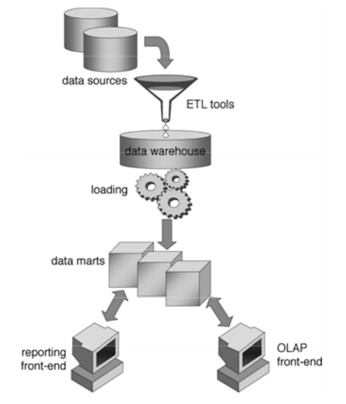
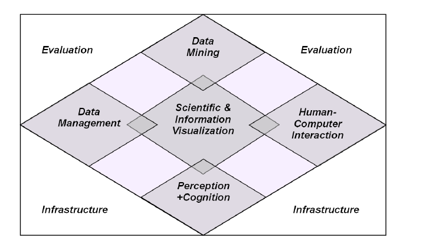

## Contexte du défi

L'intitulé du défi EIG ministère de la santé sur le [site officiel](http://www.gouvernement.fr/entrepreneur-interet-general) :

> "Utiliser les données du Système national des données de santé (SNDS) pour modéliser les parcours de soin à l'ARS Occitanie et identifier ainsi les parcours aberrants et les écarts par rapport aux recommandations de bonnes pratiques". 

### Parcours de soins
D'après la [HAS](http://www.has-sante.fr/portail/upload/docs/application/pdf/2012-05/quest-rep_parcours_de_soins.pdf), un parcours de soins doit correspondre :

> "au juste enchaînement et au bon moment de différentes compétences professionnelles liées directement ou indirectement aux soins : consultations, actes techniques ou biologiques, traitements  médicamenteux et non médicamenteux, prise en charge des épisodes aigus (décompensation, exacerbation), autres prises en charge (médico-sociales notamment, mais aussi sociales)...
La démarche consiste à développer une meilleure coordination des interventions professionnelles [...] lors des phases aiguës de la maladie comme lors de l'accompagnement global du patient sur le long terme". 

En prenant l'exemple de l'accident vasculaire cérébral (AVC), plusieurs dizaines de professionnels (régulateurs, urgentistes, neurologue, infirmiers, aides-soignants, orthophonistes, kinésithérapeutes, psychologues, ergothérapeutes, assistantes sociales ...) doivent se coordonner pour la prise en charge du patient, de la phase aiguë de la maladie à la phase chronique. 

Les informations enregistrées tout au long du parcours de soins du patient peuvent permettre de comprendre l'organisation de la prise en charge d'une maladie chronique sur un territoire de santé et identifier des points de rupture. L'analyse des parcours des patients permettrait aux décideurs de santé publique d'améliorer les filières de soins existantes. Ces informations sont cependant enregistrées dans différents systèmes d'information (SI). Par exemple : 

  - Le centre 15 va enregistrer dans son SI : l'heure d'appel, le motif d'appel, le diagnostic de régulation, le moyen envoyé, l'appelant, le lieu d'appel ...
  - L'hôpital où le patient sera hospitalisé en urgences va enregistrer dans son SI : le motif de consultation (si passage par les urgences), les examens réalisés (imagerie, biologie), les traitements administrés, les mouvements du patient dans différents services (urgences, unité d'hospitalisation), les diagnostics au cours de l'hospitalisation, la durée de séjour, le compte-rendu d'hospitalisation ...
  - L'établissement de soins de suite et de réadaptation (SSR) enregistra dans son SI des informations sur les séquelles du patient, son degré d'autonomie et de handicap, son plan de soins... 
  - Les médecins de ville ont leur propre système d'information, ils enregistrent les informations qu'ils jugent nécessaires au suivi de leur patient (motif de consultation, antécédents ...)
  - ...

Le cloisonnement des SI, le caractère sensible des données et le manque d'interopérabilité rendent problématiques la reconstruction des parcours de soins des patients. Pour faciliter la coordination des soins, les professionnels de santé peuvent utiliser des plateformes collaboratives (ex : PAACO en Aquitaine) pour échanger des éléments d'information importants entre eux autour d'un même patient. En revanche, les décideurs de santé publique chargés de l'organisation des soins n'ont pas la vision globale nécessaire à leurs prises de décision.

### SNDS
Dans le cadre du financement à l'activité de notre système de santé, certaines données des systèmes d'information cités plus haut sont automatiquement extraites et transmises aux tutelles. Par exemple, les établissements de santé tarifés à l'activité doivent recueillir une information exhaustive, standardisée selon leur secteur d'activité : MCO (médecine, chirurgie, obstétrique), SSR (Soins de suite et de réadaptation), HAD (hospitalisation à domicile) ou psychiatrie. Ces informations standardisées constituent le programme de médicalisation des systèmes d'information (PMSI). En ville, les soins soumis à un remboursement par l'assurance maladie (consultation chez un médecin, prise de sang dans un laboratoire, délivrance de médicaments ...) sont enregistrés dans le système national d'information interrégimes de l'assurance maladie (SNIIRAM). 
Toutes ces informations de liquidation sont anonymisées par un processus de hachage basé sur le numéro de sécurité social (NIR), la date de naissance et le sexe. Comme le même processus de hachage est utilisé, les informations d'un même patient peuvent être chaînées via un numéro haché. Cependant, l'accès à ces bases est restreint et des autorisations supplémentaires sont nécessaires pour réaliser un chaînage : ce dernier fragilise l'anonymisation et augmente le risque de ré-identification. 

Le SNDS (système national des données de santé - [article 193](https://www.legifrance.gouv.fr/affichTexteArticle.do;jsessionid=EB2A5CA29143640025BEE703D4CD1692.tpdila10v_3?idArticle=JORFARTI000031914480&categorieLien=id&cidTexte=JORFTEXT000031912641&dateTexte=) de la loi du 26 janvier 2016 de modernisation de notre système de santé) a pour objectif de réunir les bases de données suivantes :

* PMSI (MCO, SSR, HAD, Psychiatrie)
* SNIIRAM
* Les données sur les causes de décès (CépiDC)
* Les données médico-sociales de la Caisse nationale de solidarité pour l'autonomie (CNSA) 
* Un échantillon représentatif des données de remboursement des complémentaires

La loi prévoit d'élargir l'accessibilité à cette base. 
Il serait possible de reconstituer des parcours de soins (villes, hôpital, médico-sociales, décès) à partir du SNDS pour permettre aux décideurs de santé publique de comprendre et analyser les parcours de soins. 

### Précision du sujet
Le défi consiste à développer un prototype de système d'information décisionnel permettant aux décideurs de santé publique, chargés de la planification et l'organisation des soins sur un territoire, de visualiser et d'analyser les parcours de soins. Sa conception devra être assez générique pour pouvoir s'adapter à plusieurs maladies chroniques. 

## Etat de l'art

### Les SID
L'informatique décisionnelle est un champ de l'informatique qui s'intéresse à ce type de problème. D'après [wikipédia](https://fr.wikipedia.org/wiki/Informatique_d%C3%A9cisionnelle) : 

> "C'est l'informatique à l'usage des décideurs et des dirigeants d'entreprises. Elle désigne les moyens, les outils et les méthodes qui permettent de collecter, consolider, modéliser et restituer les données, matérielles ou immatérielles, d'une entreprise en vue d'offrir une aide à la décision et de permettre à un décideur d'avoir une vue d'ensemble de l'activité traitée".

Dans un système informatique décisionnel (SID), les données sont extraites périodiquement de sources hétérogènes : fichiers plats, fichiers Excel, base de données, service web, données massives et stockées dans un entrepôt de données.

> "Les données sont restructurées, enrichies, agrégées, reformatées pour être présentées à l'utilisateur sous une forme sémantique (vues métiers ayant du sens) qui permettent aux décideurs d'interagir avec les données sans avoir à connaître leur structure de stockage physique. Ces données sont livrées aux divers domaines fonctionnels (direction stratégique, finance, production, comptabilité, ressources humaines, etc.) à travers un système de sécurité ou de datamart spécialisés à des fins de consultations".

### Visual Analytics
Pour la partie analyse et visualisation (reporting), les SID s'appuient sur les technologies de "Visual Analytics". D'après Keim et al. : 

> "Visual analytics research is highly interdisciplinary and combines various related research areas such as visualization, data mining, data management, data fusion, statistics and cognition science. 
Visual analytics combines automated analysis techniques with interactive visualizations for an effective understanding, reasoning and decision making on the basis of very large and complex data sets.
Visual analytics is more than just visualization. It can rather be seen as an integral approach to decision-making, combining visualization, human factors and data analysis. 
Visual analytics aims to combine and integrate the strengths of computers and humans into an interactive process to extract knowledge from data". 

#### Infrastructure et DataManagement
L'infrastructure intervient lorsqu'un passage à l'échelle du SID est nécessaire. 

Le Data Management est une étape importante pour que les données soient "prêtes" à être requêtées pour les besoins de l'utilisateur. Les sources de données doivent être identifiées, des étapes ETL sont à créer pour faire rentrer les données dans l'entrepôt. Pour les requêtes, la technique OLAP (OnLine Analytical Processing) propose de précalculer les requêtes qu'un utilisateur pourrait réaliser et de les stocker sous forme de "datacube". Ces datacubes contiennent des aggrégats (moyenne, somme ...) selon différentes dimensions (géographique : région, département...), de certaines mesures (nombre d'hospitalisation...).

#### DataVisualisation
La visualisation des informations doit s'adapter aux différents types de données. Shneiderman et al. considèrent sept types de données différentes : 

  - 1D : documents textuels, liste de pathologies
  - 2D : les données spatiales
  - 3D : pour représenter une molécule, un organe
  - Données temporelles (timeline, planning)
  - Données multidimensionnelles : Par exemple, les données sur les établissements. Chaque établissement possède un nombre n d'attributs. Chaque valeur d'un attribut est un point dans un espace à n dimensions.
  - Données sous forme d'arbre (tree) : la hiérarchie des zones géographiques en France par exemple (régions, département, arrondissements, communes)
  - Données sous forme de réseaux (network) : les flux entre établissements forment un réseau
  
Hormis le type de données 3D, nous avons dans nos données parcours tous les autres types. Pour chaque type de données, plusieurs méthodes de data visualization existent. 
Par exemple, Aigner et al. se sont intéressés aux méthodes de visualisation de données temporelles. Ils identifient plusieurs types de données temporelles : linéaire versus cyclique (saisons), time points versus times intervals (primitives), données ordonnées ou non (happen one after the other), branching time (plusieurs scénarios possibles). Le choix de la méthode de visualisation doit s'effectuer en fonction du type de données temporelles. Dans notre cas de données parcours, la "timeLine" ou "LifeLines"(visualize personal histories) semble adapter à notre besoin.

#### Interactivité
Aigner et al. insistent sur l'importance de l'interactivité : 

> "Interaction is a must to facilitate different user tasks including navigation, directed or undirected search, comparison, manipulation. Not only selecting an appropriate technique is decisive for successful visualization, but also the proper parameterization of the chosen technique". 

Shneiderman et al. identifient sept fonctionnalités que l'utilisateur doit pouvoir réaliser : 

  - Overview : gain an overview of the entire collection
  - Zoom : on items of interest
  - Filter : uninteresting items
  - Details-on-demand : select an item or group and get details
  - Relate : view relationships among items
  - History : keep a history of actions to support undo, replay
  - Extract : allow extraction of sub-colections

### Solutions commerciales
En 2012, Zhang et al. (Visual Analytics for the Big Data Era – A Comparative Review of State-of-the-Art Commercial Systems) ont comparé les applications de Visual Analytics qui sont, d'après les auteurs, des "toolkits" intégrés à des applications de business intelligence (système informatique décisionnel).
Les trois principaux composants d'un Visual Analytic Toolkit sont : 

- Le data management (loading, preprocessing, transformation)
- L'analyse : méthodes de réduction de la dimension (PCA...), de clustering ...
- La visualisation : les auteurs distinguent les types de représentation graphiques disponibles et les méthodes d'interactivité (liberté et flexibilité de l'utilisateur)

Les auteurs ont demandé un accès temporaire aux applications pour les tester. Ils ont utilisé une base de données test, à partir d'un case d'usage ils ont comparé les fonctionnalités et possibilités de chaque outil.  
En 2017, ce [site](https://www.getapp.com/business-intelligence-analytics-software/business-intelligence/#getrank) classe les différentes solutions BI. Certaines solutions sont bien connues comme Tableau, QlikView, Business Object (très utilisé au CHU de Bordeaux). 

Quelques commentaires personnels sur ce type d'outils : ils sont dotés de multiples connecteurs pour accéder à différentes sources de données mais les fonctions de data management semblent limitées. Dans notre cas, les données devront être au préalable pré-processées pour créer une sorte de "datamart" parcours de soins d'une pathologie donnée avant de pouvoir être chargée dans ce type d'outils. Je n'imagine pas que ce type d'outils puisse faire de grosses étapes d'intégration. Tous ces outils sont payants. Certains offrent une période d'essai gratuite avec des fonctionnalités limitées, voir ce [lien](https://www.yurbi.com/blog/the-best-free-business-intelligence-solutions/). Les solutions open-source trouvées se limitent à [widestage](http://widestage.com/en) et [birt](http://www.eclipse.org/birt/about/). La question des alternatives aux solutions payantes a été posée récemment sur [Quora](https://www.quora.com/Is-there-an-inexpensive-alternative-to-Tableau).   
Un avantage et un inconvénient à ce type d'outil est leur généricité. Ils permettent d'analyser tout type de données mais ils peuvent manquer de spécificité pour notre cas d'usage. 
Une critique intéressante de Zhang et al. sur ce type d'outil est la suivante :

> "In general, the open source domain provides state-of-the-art functionality. Commercial products take longer time to integrate innovative visualization techniques". 

## Réflexions sur le défi
Le défi consiste à développer un prototype de SID spécifique à l'analyse du parcours de soins en utilisant des outils open source pour chaque composant. Les trois principaux composants décrits par Zhang et al. sont discutés dans les sous-sections suivantes. 

### Infrastructure / datamanagement
Les questions qu'on peut se poser sont les suivantes : Comment gérer et exploiter plusieurs sources de données hétérogènes ? Comment reconstituer un parcours de soins à partir de ces données ? Comment intégrer des données externes (par exemple les métadonnées sur les établissements : localisation géographique, nombre de lits ...) Comment intégrer des connaissances externes (par exemple les guidelines) ? Comment faire le lien avec l'interface de visualisation ?

La dimension temporelle des données est très importante. L'état d'un patient évolue au cours du temps : son âge, ses facteurs de risque, ses pathologies. Si on veut savoir combien de patients hospitalisés pour un AVC étaient diabétiques, il faut être capable de localiser la notion de "diabète" dans les différentes sources (l'ALD dans le SNIIRAM, un code diagnostic dans le PMSI...) et prendre en compte la notion d'antériorité / postériorité entre l'hospitalisation pour un AVC et le diagnostic de diabète. Si les données sont mal organisées, une telle requête sera lente et compliquée à formuler ; la maintenabilité est aussi un problème. 
Une première piste pour résoudre ce problème est l'utilisation d'ontologies pour modéliser les connaissances, faciliter l'intégration des données dans un entrepôt, vérifier la cohérence des données et raisonner sur ces données. Pour ce dernier point, il existe par exemple la Time Ontology décrite en OWL développée pour le domaine médical par Hemalatha et al. 

L'idée d'utiliser des ontologies pour exploiter de telles données n'est pas nouvelle. Dans sa thèse de science (Exploitation d'un entrepôt de données guidée par des ontologie : application au management hospitalier), Lama EL SARRAJ utilise une ontologie de domaine du PMSI. Une équipe de recherche en informatique médicale à Rennes s'intéresse aux ontologies et technologies du web sémantique pour l'exploitation des données médico-administratives (Olivier Dameron et Nolwenn Le Meur, une infrastructure générique basée sur les apports du Web Sémantique pour l'analyse des bases médico-administratives). La pharmacovigilance du CHU de Rennes s'intéresse aussi à cette approche pour analyser les données du SNIIRAM : "L'objectif est de proposer des méthodes génériques pour la modélisation du parcours de soins des patients s'appuyant sur des méthodes de raisonnement (temporel) à partir des informations du patient et de l'ontologie".

### Data visualisation
Comment offrir une interface interactive pour visualiser ces différents types de données : temporelles, spatiales, multidimensionnelles ?

Une réflexion doit être menée pour visualiser les différents types de données de notre cas d'usage.

Les semaines précédentes, je m'étais intéressé à la visualisation de données spatiales avec Leaflet. 

Pour les données multidimensionnelles, les tableaux croisés dynamiques (pivot table) sont fréquemment utilisés sous Excel. Il existe des solutions équivalentes open source, par exemple PivotTable.js.

Pour la visualisation de réseaux, D3.js et vis.js proposent des solutions intéressantes. 

Pour la visualisation de données temporelles, les timelines semblent pertinentes pour notre cas d'usage. Dans le cadre d'un master d'informatique, Ingunn Skjevdal Hansen et Gry Sundt s'étaient intéressés à la visualisation des parcours de soins de patients atteints d'AVC (Visualization of Actual and Expected Trajectories for Stroke Patients). Les auteurs avaient utilisés la "CHAP Links Timeline" dont le successeur est la libraire vis.js, dont on peut voir un exemple pour notre cas d'usage : 

/ ](./images/timeline.png)

Des solutions doivent être cherchées pour visualiser plusieurs timelines simultanément. 
Le logiciel [EventFlow](http://www.cs.umd.edu/hcil/eventflow/manual/) développé à l'université du Maryland s'est penché sur ce problème. Le projet est supervisé par Catherine Plaisant et Ben Shneiderman, deux universitaires qui ont beaucoup publié sur ce sujet. Malheureusement, ce logiciel n'est pas opensource mais il peut être utilisé gratuitement à des fins non commerciales. 

### Data analysis

Quelles méthodes existent pour analyser ce type de données ? 

Keim et al. ont modifié le mantra de Shneiderman. Initialement : "Overview first, zoom and filter, then details-on-demand", Keim et al. proposent : "Analyse first, show the important, zoom and filter, analyse further, details on Demand". L'idée sous-jacente est qu'il peut être difficile de naviguer dans des données brutes, qu'il est plus facile de manipuler des données d'un niveau d'abstraction plus élevé (When dealing with large volumes of data, additional analytical methods have to be included to derive higher levels of abstraction of the data).

Les méthodes d'analyse de données peuvent permettre d'aider l'utilisateur à comprendre l'hétérogénéité des parcours de soins. A partir de certaines mesures de similarités, les méthodes de clustering peuvent résumer l'information, faciliter l'identification d'atypies...
Une crainte de ces méthodes est une interprétation difficile ou erronée des résultats d'une analyse. 
On peut citer des travaux français comme : 

- Nicolas Jay, thèse de médecine : analyse de la trajectoire de soins en cancérologie
- Thèse de science de Elias Egho (dirigée par Nicolas Jay) sur l'extraction de motifs séquentiels dans des données séquentielles multidimensionnelles et hétérogènes - une application à l'analyse de trajectoires de patients
- l'article de Nolwenn Le Meur et al. sur "Mining care trajectories using health administrative information systems: the use of state sequence analysis to assess disparities in prenatal care consumption"
- l'article de Vincent Augusto et al. sur "Evaluation of discovered clinical pathways using process mining and joint agent-based discrete-event simulation"

