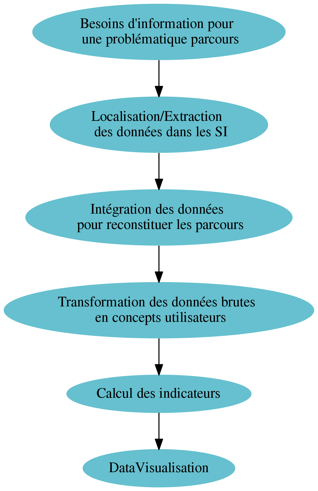
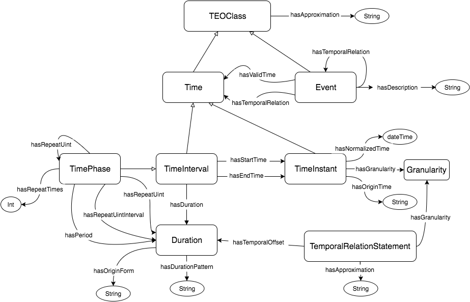
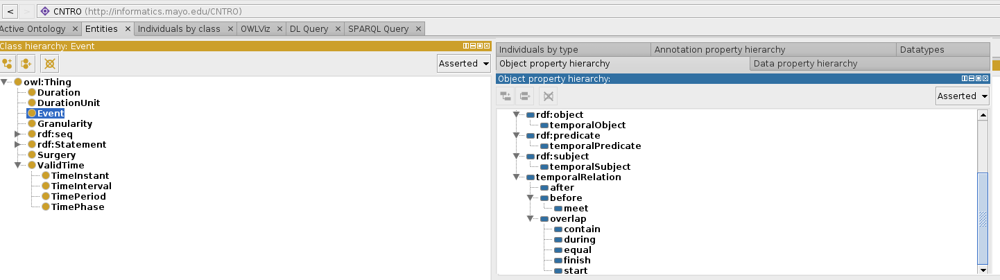
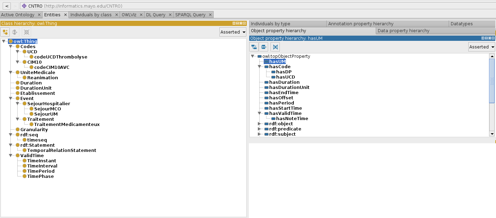
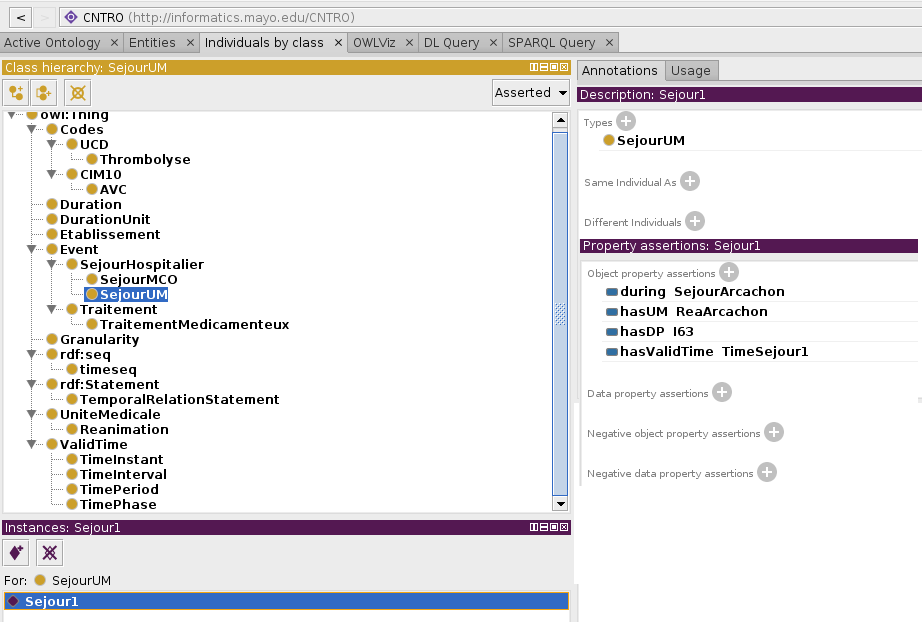
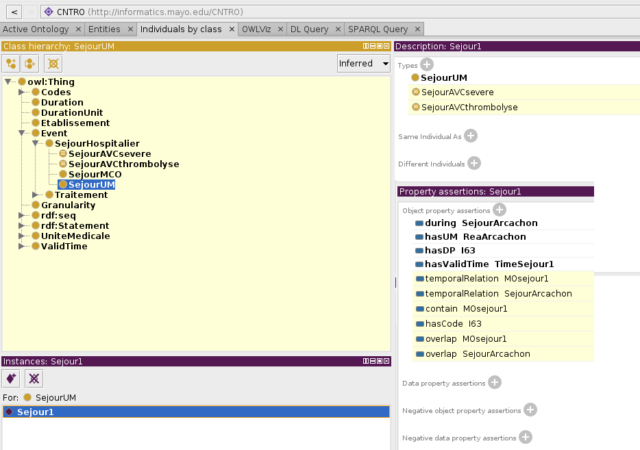
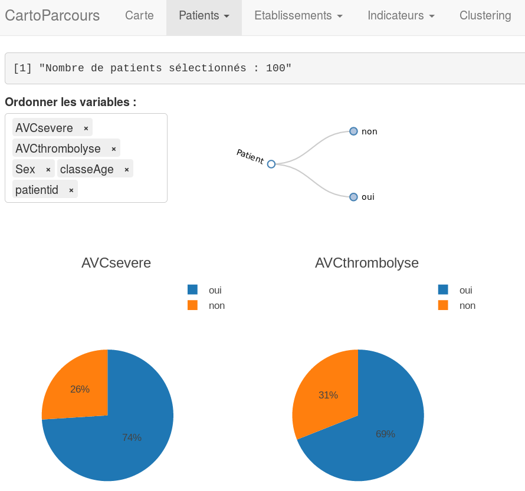

<style type="text/css">

body{ /* Normal  */
   font-size: 1.75em;
   /*max-width: 1100px;*/
   margin: auto;
}

.main-container{
max-width: 80%;
}

h1.title { /* Header 1 */
 font-size: 3em;
 color: DarkBlue;
 text-align:center;
}

h4.date {
 text-align:center;
}

h1 { /* Header 2 */
 
 font-size: 1.5em;
 color: DarkBlue;
 text-align:center;
 margin-top:100px;
 margin-bottom:50px;
}

h2 { /* Header 3 */
 font-size: 1.5em;
 color: #c9b53a;
 margin-left:40px;
}

h3 { /* Header 3 */
 font-size: 1.1em;
 color: #0c813c;
 margin-left:80px;
}


h4 { /* Header 3 */
 font-size: 1.8em;
 color: black;
 margin-left:60px;
}


.etapes{
width: 400px;
height: 600px;
}

img{
display: block;
margin-left: auto;
margin-right: auto 
}

.allen {
width: 500px;
height: 250px;
}

.modules{
width: 500px;
height: 600px;
}

.AVCsevere{
width: 600px;
height: 600px;
}

</style>

Ce post est composé de trois parties et une conclusion : 

* Dans la première partie, je présente les différentes étapes à suivre pour passer d'une problématique "parcours de soins" à une datavisualisation. 
* Dans la seconde partie, je propose une approche générique pour traiter plusieurs problématiques parcours. 
* Dans la troisième partie, je montre concrètement, à l'aide d'un exemple, le fonctionnement de cette approche générique. 

# I. Problématique

## Où sont les données ? 
Le point de départ est la description des besoins d'information. Par exemple, pour la problématique des parcours de soins de patients atteints d'un accident vasculaire cérébral (AVC), nous nous posons les questions suivantes :

* Dans quelles structures de santé vont les patients jeunes après une hospitalisation pour un AVC sévère ? 
* Quels sont les délais de transfert en EHPAD ?

Ces besoins en information sont ensuite traduits en un inventaire de données à mobiliser pour y répondre. Les questions sont les suivantes : 

* Est-ce que la donnée existe ?
* Est-ce que la donnée est accessible (droit d'accès) ?
* Est-ce que la donnée est chaînable ? Est-il possible de la rattacher à un patient dans un autre système d'information (SI) ? Par exemple, le chaînage ville-hôpital est réalisé avec une fonction de hachage (FOIN : Fonction d'Occultation des Informations Nominatives) qui calcule une clef de chaînage à partir du NIR (numéro de sécurité sociale), du sexe et la date de naissance du patient. 
* Est-ce que la donnée est de bonne qualité ? On peut imaginer plusieurs défauts à une donnée :
    + Défaut de remplissage  
La donnée est mal renseignée (champs vide ou valeur par défaut) car elle n'influence ni la prise en charge du patient ni l'aspect financier. Ce défaut peut être détecté via des incohérences (ex : retour du patient à domicile à la fin d'un séjour alors que le patient est hospitalisé dans un autre établissement). Les gestionnaires de bases de données ont une idée subjective ou objective de la qualité de remplissage de chaque variable. 
    + Défaut de granularité  
Exemple: nous disposons d'un code géographique PMSI (regroupement de codes postaux) alors que nous avons besoin de connaître le code postal.  
    + Défaut de sensibilité / spécificité.  
Exemple : en utilisant un ensemble de codes pour identifier une maladie précise (ex: les AVC sévères), nous ne sommes jamais sûrs d'avoir identifié tous les malades que nous souhaitions (sensibilité), ni d'avoir inclus à tort des patients n'ayant pas la maladie recherchée (spécificité).

## Comment intégrer les données ?
Comme il a été expliqué dans un [post précédent](http://www.eigsante2017.fr/rapports/rapport4.html), les données peuvent être localisées dans plusieurs systèmes d'information (SI).
L'intégration de données consiste à combiner les données de différents SI pour disposer d'une vue unifiée. L'intégration permet de reconstituer les parcours de soins. Il est nécessaire de résoudre trois principaux problèmes d'hétérogénéité entre SI :  

* Structurelle : chaque SI a ses propres schémas de base de données
* Syntaxique/technique : les données sont disponibles dans différents formats, avec différents protocoles et langages de requête
* Sémantique : le sens des données et leur interprétation dépendent du contexte

Les deux principales méthodes d'intégration sont : 

1. Extraire et stocker  

Les données sont extraites dans les différents SI pour créer un "datamart", base de données dédiée à une problématique parcours (ex : l'AVC). Les données sont transformées, les indicateurs sont pré-calculés et stockés pour répondre rapidement aux requêtes des utilisateurs.  

Cette approche passe généralement par la création, au préalable, d'un "entrepôt de données" où les données des différents SI sont intégrées. De cet entrepôt sont créés les datamarts. Une fois mis en place, le SNDS aura un rôle d'entrepôt ce qui devrait faciliter l'analyse des parcours de soins. 

L'avantage de cette méthode est d'offrir des performances élevées en temps de réponse à une requête utilisateur pour permettre une datavisualisation en temps réel. Le principal inconvénient est de devoir créer une nouvelle base de données ce qui pose des problèmes juridiques. Le volume de données n'est pas gigantesque pour une problématique donnée. La gestion des mises à jour est un inconvénient mais négligeable sur des données parcours où seule une analyse rétrospective est réalisée.  

2. Interroger les SI  

L'intégration est virtuelle : les données restent dans les SI, la requête d'un utilisateur est transformée en de multiples requêtes qui vont interroger les différentes sources au moment où la requête est formulée. Les résultats des différentes requêtes sont ensuites fusionnées et transformées pour calculer les indicateurs et répondre à la requête initiale.  
Le principal avantage de cette approche est d'interroger des données à jour, ce qui n'est pas un impératif pour l'analyse des parcours. Les inconvénients de cette approche sont : 

* Le besoin de disposer d'un moyen de communication avec chaque source de données (HTTP, SOAP, ODBC ...)
* La necessité de traduire chaque requête en une nouvelle requête pour chaque source de données
* Des performances très mauvaises dès que la requête est complexe, ce qui rend impossible une interactivité en datavisualisation. 
* Analyse de données nécessitant l'ensemble des données (clustering...) impossible

Quelque soit la méthode d'intégration, les traitements de données pour une analyse parcours requièrent de disposer d'une autorisation CNIL et de respecter toutes les règles de sécurité pour leur stockage et leur transfert. Aussi, le croisement de données de plusieurs sources affaiblit la pseudo-anonymisation des données et augmente le risque de ré-identification des patients. 

## Comment répondre aux besoins utilisateurs avec les données brutes ?

* Dans quelles structures de santé vont les patients jeunes après une hospitalisation pour un AVC sévère ? 

Qu'est-ce qu'un AVC sévère ? Qu'est-ce qu'un patient jeune ? Qu'est-ce qu'une hospitalisation ? L'utilisation de termes ambigus comme "AVC sévère" est susceptible d'entraîner des problèmes de compréhension entre humains et entre un humain et une machine ("qu'est-ce que cet indicateur signifie ?") en l'absence de définition formelle. 

### Etapes de transformation
Une étape de transformation est nécessaire pour passer des données brutes en concepts utilisateurs. Un AVC sévère peut être défini comme le séjour d'un patient hospitalisé dans un établissement MCO avec au moins un passage en réanimation (unité médicale) pour un AVC (codes I61, I63 ou I64 en diagnostic principal). Cette transformation nécessite l'apport de connaissances externes qui doivent être consensuelles et partagées. 

<!-- Nous verrons par la suite qu'une ontologie est une solution pour décrire, partager et inférer des connaissances.   -->

### Calculs des indicateurs

Les indicateurs sont calculés pour chaque parcours puis agrégés lors d'une requête utilisateur. 

La qualité de chaque indicateur dépend de la qualité des données utilisées pour son calcul comme il a été discuté plus haut. Pour l'indicateur "AVC sévère"" par exemple, on peut se poser les questions suivantes : est-ce que le codage du diagnostic principal est bien réalisé en réanimation et reflète bien le motif d'hospitalisation du patient ? Est-ce qu'il existe une hétérogénéité de codage inter-établissement ? 

La nature de l'indicateur détermine la façon dont il est stocké, agrégé et visualisé : 

* Variable catégorielle  
Ex : AVC sévère. L'indicateur est une variable binaire qui vaudra 1 si l'évènement est présent et 0 sinon. Il est calculé pour chaque parcours puis agrégé en pourcentage pour un ensemble de patients. Cet indicateur peut être visualisé sous la forme d'un pie chart par exemple.

* Variable quantitative  
Ex : Temps de transfert entre deux établissements. Il est calculé pour chaque parcours quand l'évènement est présent puis agrégé sous forme de moyenne ou médiane pour un ensemble de patients. L'indicateur peut être visualisé sous la forme d'un scatter plot ou d'un box plot par exemple. 

* Données de flux  
Ex : Flux MCO - SSR. L'indicateur est constitué d'un couple de deux évènements/états (from - to). L'indicateur peut être visualisé sous la forme d'un diagramme de Sankey, d'un graphe voire une carte si les données sont géoréférencées.  

Pour une interactivité fluide lors de la datavisualisation, les indicateurs sont précalculés et stockés dans une base de données. 

## DataVisualisation

L'objectif est de fournir une interface intuitive, interactive, fluide et simple pour répondre aux besoins d'information. Un [post précédent](http://www.eigsante2017.fr/rapports/rapport4.html) discutait de Visual Analytics, l'art de faciliter le raisonnement humain par des interfaces interactives et intuitives. 


Le but n'est pas de visualiser un parcours de soins spécifique mais bien de calculer et visualiser des indicateurs issus de plusieurs parcours de soins. La reconstitution de chaque parcours de soins est nécessaire en base de données mais interdite en visualisation à cause du risque de ré-identification. Le sous-onglet "Timelines" de l'onglet "Patients" dans le [prototype 3](http://91.121.106.228:3838/V3/) est un bon exemple de ce qu'il ne faudra pas faire en datavisualisation pour des métiers ARS. 

{.etapes}

# II. Approche générique

## Introduction

Comme les problématiques parcours (AVC, Cancer, Personnes agées ...) partagent les mêmes étapes décrites plus haut, il est nécessaire de réfléchir à une solution générique pour éviter de ré-inventer la roue pour chaque problématique. 

Nous allons nous intéresser aux quatre dernières étapes du diagramme précédent qui posent des problèmes techniques informatiques purs. Pour les deux premières étapes, comment formaliser le processus d'expression des besoins et comment avoir une vue d'ensemble des données contenues dans les différents SI, sont des questions qui ne seront pas abordées ici. 

Il est possible de séparer ces quatre dernières étapes en 2 modules : un module d'intégration et un module de datavisualisation, indépendants l'un de l'autre. 
Je propose dans les sections suivantes une approche générique basée sur :

* Des ontologies pour la phase d'intégration et de transformation de données brutes en concepts
* Une interface de visualisation générique couplée à une base de données d'indicateurs
* Un programme de calcul d'indicateurs faisant le pont entre les 2 modules

## Module d'intégration 

### Intégrer des données de sources hétérogènes
En informatique, les ontologies permettent de modéliser de façon formelle (compréhensible par un ordinateur) les connaissances d'un domaine. D'après Gruber : 

> L'ontologie est une spécification explicite d'une conceptualisation. Une conceptualisation est une vue abstraite et simplifiée du monde que l'on veut représenter.

Une ontologie permet d'améliorer la communication entre humains et entre un humain et une machine. Une ontologie est composée de concepts ("AVC","AVC sévère"), de relations entre les concepts ("AVC sévère" est un type d'"AVC"), des axiomes (ensemble de règles : "AVC sévère" est un "séjour" qui possède au moins un RUM en réanimation avec les codes CIM10 suivants en DP ...) et des instances. 

Oublions les données et réfléchissons au concept de parcours. On peut conceptualiser un parcours comme une suite d'évènements (hospitalisation, consultation, examens ...) possédant une date de début, une date de fin et un lieu (établissement, cabinet, laboratoire...).

L'ontologie a le rôle d'un schéma global d'intégration (Ontology-based data integration), un médiateur pour résoudre l'hétérogénéité des différentes sources. 

Plusieurs ontologies modèlisent le temps qui est un concept fondamental dans les problématiques parcours. Le W3C a par exemple défini la Time Ontology pour décrire des concepts temporels qui sont exprimés de façon absolue (un évènement - une date). Cui Tao et al. ont créé la CNTRO (Clinical Narratives Temporal Relation Ontology) pour prendre en compte l'expression de concepts temporels relatifs. Par exemple, un clinicien dira "la bilirubine du patient est élevée 2 semaines après le cycle de chimiothérapie". La CNTRO est capable d'intégrer des concepts temporels absolus ou relatifs. Cette ontologie est disponible à [cette adresse](https://sbmi.uth.edu/ontology/project/ontology-and-examples.htm). 

Ci-dessous, l'ontologie TEO, une extension de la CNTRO. Le concept Event représente tout évènement de santé. Il est lié aux concepts temporels (Time et ses sous-classes : TimeInterval, TimeInstant). 



Exemple de triplets RDF (Ressource Description Framework) décrivant l'évènement "2ème cycle de chimiothérapie" : 

```
<event1> rdf:type Event;
	rdfs:label "the second cycle of chemotherapy";
	hasTimeStamp <tInst1>;
	
<tInst1> rdf:type TimeInstant;
	hasOrigTime "June 10, 2004";
	hasNormalizedTime 2004-06-10;
	hasGranularity "day";
```

Dans une ontologie modélisant le temps, les relations temporelles sont souvent basées sur l'algèbre d'Allen qui décrit les relations possibles entre deux évènements : 

{.allen}


Une ontologie comme la CNTRO ou la Time Ontology pourrait constituer un socle commun pour intégrer les évènements de chaque parcours. 

<!-- Retrouver toutes les séances de chimiothérapie sera difficile si les types d'évènements sont stockés dans un rdfs:label. Il est donc nécessaire d'étendre cette ontologie pour chaque problématique parcours, de créer des concepts comme "chimiothérapie" par exemple pour l'analyse des parcours cancer.  -->

<!-- Les connaissances représentées dans l'ontologie sont suffisamment exhaustives pour intégrer tout type de données pour notre cas d'usage. L'ontologie permet de vérifier la cohérence des données. -->

### Transformer des données brutes en concepts

Il est là aussi possible d'utiliser une approche ontologique. Le langage OWL (Web Ontology Language) définit des relations basées sur les logiques de description (quantificateur universel, restriction de cardinalité, disjonction...). Ces outils permettent de transformer des données brutes en données plus abstraites (ex : création du concept "AVC sévère"). Un raisonneur est un logiciel capable d'inférer de nouvelles connaissances à partir d'axiomes définis dans une ontologie. Un raisonneur pourrait par exemple inférer qu'un séjour hospitalier est un "AVC sévère" à partir de la définition fournie par l'expert métier et des données. 

### Stocker les données intégrées et transformées par nos ontologies
Les données sont instanciées via l'ontologie et représentées en RDF (Resource Description Framework). RDF est un modèle graphe de données. Son unité de base est un triplet constituté d'un sujet, un prédicat et un objet. Un triplestore est un système de gestion de bases de données (SGBD) spécialement conçu pour les données RDF. Il permet de stocker de façon efficiente les données RDF pour les interroger et les récupérer avec le langage de requête SPARQL. 

## Module de datavisualisation
Une base de données générique (relationnelle) stocke les indicateurs et est alimentée par le programme décrit plus bas. Le schéma de cette base de données est indépendant de la problématique parcours et fortement dépendant de l'interface de datavisualisation. Chaque type de visualisation (carte, Sankey, pie chart ...) sera dépendant de tables spécifiques dans la base. Ceci permet de rendre l'interface générique et modulaire.

## Programme de calculs des indicateurs
Un programme calcule les indicateurs pour chaque parcours de soins et les stocke dans une base de données utilisée pour la datavisualisation. 
Le programme calcule les indicateurs par des requêtes dans le triplestore, base de données graphe contenant les parcours de soins. Les requêtes SPARQL sont indépendantes des structures de données en entrées et sont dites de "haut niveau" car elles se basent sur le schéma de l'ontologie.  
Comme la nature des indicateurs (catégorielle, quantitative ...) est limitée, des fonctions "templates" pour la création d'indicateurs pourront être implémentées afin de générer facilement et rapidement les indicateurs. 

{.modules}

# III. Exemple

Dans cette section, je présente un exemple d'utilisation de cette méthode générique. 

## Extrait

```{r results='asis', echo=FALSE}
library(xtable)
df <- read.table("data/example.csv",sep="\t",header=T)
print(xtable(df), type="html",include.rownames=FALSE)
```

On imagine que cette ligne est issue d'une extraction d'un fichier PMSI. Elle décrit le séjour hospitalier au CHU d'Arcachon (Numéro Finess) dans une unité de réanimation d'une personne entrée le 1er janvier 2017 pour un infarctus cérébral (code I63), hospitalisée pendant 12 jours et ayant reçu une molécule onéreuse (code UCD correspondant à l'ACTILYSE 20MG). 

Le besoin d'information serait d'identifier les parcours "AVC sévère" et "AVC thrombolysés". 

## Module d'intégration

### Ontology-based data integration

La CNTRO modélise des évènements temporels (concept Event). Elle est chargée dans le logiciel [Protégé](http://protege.stanford.edu/), logiciel open-source pour la création d'ontologies. 


{.CNTROini}


Nous étendons la CNTRO pour décrire les concepts de notre problématique parcours. 
Les évènements sont les suivants : 

* Séjour Hospitalier  
C'est l'hospitalisation d'un patient dans un établissement de santé. 
* Séjour UM  
C'est le séjour d'un patient dans une unité médicale (un service). 
* Traitement  
Pour notre exemple, nous ne modélisons que les traitements médicamenteux. 

Nous définissons aussi des concepts qui ne sont pas des évènements : les terminologies FINESS, CIM10 et UCD. 
Pour le motif principal d'hospitalisation (DP : I63), il s'agit d'un attribut d'un séjour hospitalier. Nous définissons la relation "hasDP" qui fait le lien entre un SéjourHospitalier et un code CIM10. 

<!-- Il aurait été possible de représenter le concept anatomotopathologique d'infarctus cérébral, l'évènement correspondant à la zone cérébrale lésée suite à l'obstruction du vaisseau sanguin avec une date de début (le moment de l'obstruction) et sans nécessairement de date de fin (la zone est toujours lésée encore aujourd'hui).    -->

{.CNTROelargie}

L'étape suivante est d'instancier notre ontologie avec nos données. L'instanciation est réalisée manuellement ici pour l'exemple. La figure suivante décrit l'individu "Sejour1" : 

{.CNTROsejour1}

### Création de concepts
Il est nécessaire de définir les concepts "SejourAVCsevere" et "SejourAVCthrombolysé". Le concept "SejourAVCsevere" est défini en logique de description de la façon suivante : 

> SejourHospitalier and hasDP some codeCIM10AVC and hasUM some Reanimation

et "AVC thrombolysé" (contain est une relation temporelle : un évènement1 contient un autre évènement2 ; l'inverse est la relation during : l'évènement 2 survient pendant l'évènement 1) :

> SejourHospitalier and hasDP some codeCIM10AVC and contain some TraitementThrombolytique

Cette dernière définition utilise le concept de TraitementThrombolytique lui aussi concept défini : 

> TraitementMedicamenteux and hasUCD some codeUCDThrombolyse

Ces définitions sont à la fois human-readable et machine-readable. Un raisonneur est capable d'inférer que notre séjour1 est à la fois un "AVC sévère" et un "AVC thrombolysé", comme le déduirait un expert métier. 

{.CNTROinferred}


### Stockage
Après l'étape d'ETL et de raisonnement, nos données sont au format RDF. Quelques triplets RDF décrivant notre Sejour1 sont présentés ci-dessous : 

```
<http://informatics.mayo.edu/CNTRO#Sejour1> rdf:type owl:NamedIndividual ,
                                                     <http://informatics.mayo.edu/CNTRO#Event> ,
                                                     <http://informatics.mayo.edu/CNTRO#SejourAVCsevere> ,
                                                     <http://informatics.mayo.edu/CNTRO#SejourAVCthrombolyse> ,
                                                     <http://informatics.mayo.edu/CNTRO#SejourHospitalier> ,
                                                     <http://informatics.mayo.edu/CNTRO#SejourUM> ;
```

<http://informatics.mayo.edu/CNTRO#Sejour1> est l'URI (Uniform Resource Identifier) de notre ressource Sejour1 (Comme je suis parti de la CNTRO, on retrouve le préfixe de cette ontologie ; ceci devra être modifié). 
On voit qu'il y a des triplets créés par la phase d'ETL (Sejour1 est un SejourUM) et des triplets déduits par raisonnement (Sejour1 est un SejourAVCsevere). 

Ces triplets sont stockés dans un triplestore. Les triplets d'un même patient sont stockés dans un graphe qui lui est propre. 

Nous pouvons voir dans cet exemple plusieurs avantages à utiliser une ontologie :

* Le schéma d'intégration et les axiomes sont définis au même endroit
* Possibilité de réutiliser le contenu d'une ontologie pour différentes problématiques. Les concepts spécifiques au PMSI MCO seront communs à plusieurs problématiques. 
* Possibilité de décrire et partager des connaissances externes : l'ontologie offre un langage commun entre les utilisateurs (métiers ARS), les informaticiens et la machine. 
* Tout type d'évènement temporel pourrait être intégré, exprimé dans des granularités différentes (secondes, jours, années...), relatif à un autre évènement ou non. Le raisonneur est capable d'ordonner les évènements, d'affirmer si un évènement survient avant un autre ou pendant un autre ...
* Permettre la réalisation de requêtes de "haut niveau" (voir plus bas), basées sur l'ontologie. Une intégration en base de données relationnelle et des axiomes implémentés dans des requêtes SQL serait probablement moins générique. Les requêtes SQL seraient dépendantes du schéma de la base de données, non partageables ni réutilisables pour une autre problématique et complexes à réaliser à cause de l'aspect temporel et de l'hétérogénéité des données. 


## Module de datavisualisation

### Création des indicateurs
Chaque indicateur est créé par une requête SPARQL dans notre triplestore et stocké à l'endroit approprié dans la base de données des indicateurs, en fonction de sa nature. 

Une requête SPARQL aurait cette forme pour la création d'un indicateur binaire : 

```{SPARQL}
PREFIX : <http://informatics.mayo.edu/CNTRO#>
SELECT ?idPatient ?SejourAVC ?SejourAVCsevere ?SejourAVCthrombolyse
{
  GRAPH ?idPatient
      { ?SejourAVC a :SejourAVC . 
         bind( if ( exists { ?sejoursAVC a :SejourAVCsevere }, "oui", "non") as ?SejourAVCsevere)
         bind( if ( exists { ?sejoursAVC a :SejourAVCthrombolyse }, "oui", "non") as ?SejourAVCthrombolyse)
      }
}
```

Le résultat de cette requête est sous la forme d'un tableau de 4 colonnes :

* Le numéro anonyme du patient (?idPatient)
* L'identifiant du séjour si le séjour est un AVC (?SejourAVC) 
* SejourAVCsevere : oui/non 
* SejourAVCthrombolyse : oui/non

Le résultat sera directement chargé dans la base de données des indicateurs, dans une table pour variables qualitatives. L'interface de visualisation est alors en mesure de fournir le bon graphique pour cet indicateur. 

### Datavisualisation

{.AVCsevere}

<!--L'âge peut être considéré comme un évènement de santé d'une durée d'un an entre les deux date d'anniversaire. Nous savons ici que son âge à l'entrée était de 74 ans, son âge à la sortie pourrait être de 75 ans.-->

## Clustering

Un petit mot sur le clustering que je n'ai pas abordé jusqu'à présent mais qui s'intégrera parfaitement dans cette approche générique pour les raisons qui vont suivre. 

Le clustering consiste à mettre en évidence un ensemble de parcours homogènes qui partagent un ensemble de caractéristiques communes. Il peut aussi mettre en évidence des parcours atypiques via une mesure de dissimilarité. Le clustering permet à l'utilisateur d'être guidé dans son analyse parcours. 

<!-- L'autre fonctionnalité intéressante serait la comparaison de cohortes : comparer par exemple les AVC sévères et non sévères pour trouver des différences de parcours, ou comparer une zone géographique avec une autre.  -->

Le clustering sera réalisé sur la base de données des indicateurs pour les raisons suivantes : 

* Comme la structure de la base de données est fixe, il est possible d'implémenter des algorithmes de clustering qui ne dépendront pas de la problématique parcours. Ces algorithmes, comme la datavisualisation, seront dépendants du type de données : données séquentielles, données tabulaires, données spatiales ...

* Comme la base de données contient un nombre de données limité et des concepts de "haut niveau", le clustering est facilité. Par exemple deux traitement thrombolytiques apparaissent totalement différents pour une machine, la dissimilarité est maximale, le clustering sur données brutes est difficilement réalisable. Regroupons ces deux traitements sous le concept de thrombolyse, regroupons des codes CIM10 sous le concept d'AVC... Ces regroupements réduisent le nombre de dimensions et la machine est capable de trouver des similarités et des dissimilarités qui ont du sens.

* Comme la datavisualisation et les algorithmes de clustering s'appuient sur la même base de données, les résultats du clustering seront directement visualisables sans effort technique supplémentaire. 


# IV. Conclusion 

Je propose dans ce post une approche générique pour l'intégration, la datavisualisation et le clustering de données parcours. 
Il sera intéressant de voir comment cette approche résiste face à des données réelles. 

Les prochaines étapes sont les suivantes : 

* Création d'une base de données générique pour le stockage des indicateurs
* Alimentation de cette base avec des données fictives (déjà créées dans le prototype précédent)
* Ajout au prototype d'un algorithme de clustering pour montrer la faisabilité 
* Intégration de données réelles