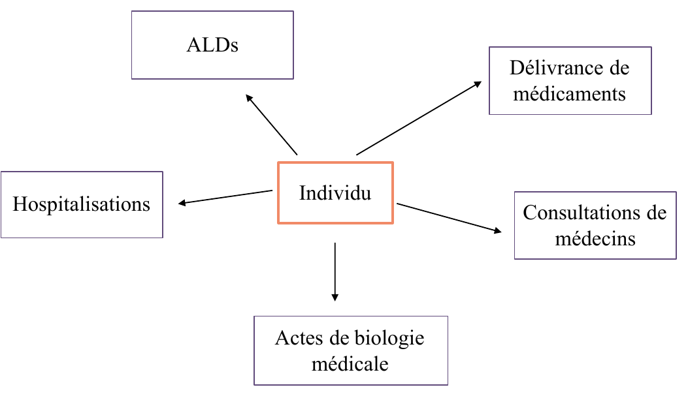
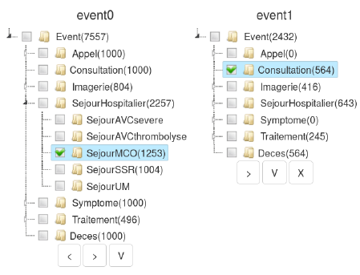

# I. Retour d'expériences des séminaires de Rennes et de Corté

J'ai eu le plaisir de me rendre à Rennes le 25 et 26 juin pour un [séminaire sur la recherche en santé](http://www.rennes-donnees-sante-2017.fr/) organisé par le consortium PEPS/ANSM (Pharmaco-Épidémiologie des Produits de Santé) puis à la [9ème école d'été méditerranéenne d'information en santé](http://lertim.timone.univ-mrs.fr/Ecoles/infoSante/2017/premiere.php?menu=32) à Corté du 17 au 19 juillet organisée par les associations d'informatique médicale AMIS, AIM et l'Institut Open Health. Les diapositives des présentations sont présentes sur ces deux sites au moment de l'écriture de ce post.

## Petit résumé

Plusieurs présentations concernaient les outils d'analyse et de datavisualisation de parcours de soins : 

* Catherine Plaisant de l'université du Maryland est venue présenter à Rennes le logiciel [EventFlow](http://hcil.umd.edu/eventflow/). Celui-ci n'est pas spécifique au domaine médical mais a été utilisé plusieurs fois pour analyser des trajectoires de soins. Il a bénéficié des travaux de chercheurs réputés dans le domaine des interactions homme-machine (Ben Shneiderman, Catherine Plaisant). Le projet a débuté en 1998, la première version s'appelait "LifeLines". Le logiciel n'est pas open-source mais peut être utilisé gratuitement dans un cadre non commercial. 
* Romain Olekhnovitch, travaillant sur la cohorte CONSTANCES (INSERM), a présenté à Corté "Exploration des trajectoires de soins dans le Sniiram". Le logiciel EventFlow a été  utilisé pour visualiser les parcours de cette cohorte. 

* André Happe, Erwan Drezen et Thomas Guyet, membres organisateurs du séminaire à Rennes, ont présenté leurs travaux réalisés dans le cadre du consortium de pharmaco-épidémiologie des produits de santé (PEPS) financé par l'Agence Nationale de Sécurité du Médicament (ANSM). A partir des données SNIIRAM (SNDS), ils fournissent des outils pour rechercher, filtrer et visualiser des parcours de soins. La solution développée permettrait de répondre à ce défi EIG mais comme le projet n'émane pas de la même structure au sein du ministère de la santé, les possibilités de partage de ressources (matériel, données, savoir, programmes...) sont pour l'instant limitées. 

[^1]: Ce défi est rattaché à la Délégation à la Stratégie des Systèmes d'Information en santé (DDSSIS).

D'autres acteurs ont manifesté leur intérêt pour cette thématique : 

* Stéphane Gaïffas de l'école polytechnique a mentionné l'objectif d'analyser les pacours de soins dans le cadre du partenariat entre la CNAMTS et l'école polytechnique lors de sa présentation à Rennes (slide 3). Dans une [interview](http://www.openhealth.fr/en/ressources/news/26-news/actualite/2783-les-algorithmes-au-service-de-la-sante-publique), le responsable du projet affirme même que "le Graal, pour moi, ce serait d’arriver à faire du clustering sur le parcours de soins" ! 

* Les chercheurs en informatique médicale en milieu hospitalier. Le Pr Nicolas Jay du CHU de Nancy a présenté à Rennes une méthode de clustering des parcours de soins basée sur l'analyse de concepts formels. 

## Enseignement

### Modèle de données
Pour fournir aux utilisateurs une interface interactive d'exploration des parcours de soins, l'étape de modélisation des données est fondamentale. Les données doivent être prêtes à subir des requêtes temporelles. 
Pour réaliser ce défi, il faudrait créer une base fille du SNDS dédiée à l'analyse des parcours de soins. La structure actuelle du SNDS n'est pas adaptée. 

Megan Monroe qui a travaillé sur le logiciel EventFlow explique que les bases relationnelles sont inadaptées aux requêtes temporelles. Il serait rapidement nécessaire de réaliser un grand nombre de jointures. 
L'équipe PEPS a créé un nouveau modèle de données avec des concepts explicites pour l'épidémiologie : patient, médecin, séjour hospitalier, médicament. Romain Olekhnovitch a créé des tables simplifiées centrées sur l'individu : 

{.AVCsevere}

Quelques idées communes ressorties de ces échanges étaient le besoin de transformer les données brutes en concepts compréhensibles par les utilisateurs finaux et centrer les données autour du patient. Les approches de modélisation des parcours sont cependant différentes. EventFlow utilise un modèle de données avec 4 colonnes : 

* RecordId
* Event Category
* Start Time
* End Time

L'avantage est qu'il est facile de commencer à utiliser le logiciel, le format est extrêment simple et générique. L'inconvénient est que cette simplification limite l'hétérogénéité des catégories d'évènement en entrées. 
L'équipe PEPS a présenté le modèle de "chroniques" pour l'interrogation et la fouille de séquences de soins. Elle mentionne l'approche par web sémantique (SPARQL) que j'ai choisie d'utiliser (slide 18 - analyse des parcours de soins vus par le SNIIRAM) pour ce défi EIG. 

### Changement de paradigme

Jusqu'au prototype 3, je m'étais intéressé aux différents types de données à visualiser et aux outils open source JavaScript disponibles sous Shiny. 
Dans un post précédent, je proposais un framework pour développer des dashboard qui, pour résumer, se basait sur : 

* Un modèle de données générique pour l'intégration (Ontology Based Data Integration)
* Une base de données d'indicateurs
* Une interface de datavisualisation

A chaque nouvelle problématique parcours (AVC, personnes âgées), les indicateurs seraient définis avec les utilisateurs et un nouveau dashboard serait créé.

La principale limite de cette approche est qu'elle nécessite de définir au préalable l'ensemble des indicateurs qu'on souhaite visualiser ce qui limite l'interactivité. Par exemple, un utilisateur voudrait savoir ce qu'il s'est passé entre deux évènements de santé sans définir à l'avance la nature de ces évènements. Puis, voyant le résultat de cette requête, il déciderait d'en réaliser une autre. 

Offrir la possibilité à l'utilisateur d'explorer les parcours de soins, de réaliser lui-même des requêtes temporelles, constitue un changement de paradigme et requière une modélisation différente des données. 
Cette fonctionnalité est implémentée par EventFlow. Les "Visual Analytic Toolkit" comme Tableau ne prennent pas en compte la nature temporelle des données dans leur modèle pour offrir cette fonctionnalité. 

Le [prototype 4](http://91.121.106.228:3838/V4/) avait pour objectif de montrer cette fonctionnalité. 

La structure hiérarchique des évènements est présentée sous la forme d'un arbre. 
Un indicateur HAS sur les parcours AVC est le taux de patients consultant un médecin de la filière AVC (neurologue, médecin MPR...) dans les 6 mois après un AVC. 
L'utilisateur va réaliser lui-même cette requête. Il commence par sélectionner les SejourMCO. Après validation, un filtre apparaît lui permettant de sélectionner seulement les SejourMCO pour un AVC. Il sélectionne ensuite une consultation chez un médecin de la filière AVC en évènement suivant et fixe le délai entre ces 2 évènements. 

Ce prototype a été présenté début juillet. Cette nouvelle fonctionnalité fournit plus de liberté et d'interactivité à l'utilisateur. Le prototype final implémentera cette fonctionnalité. Son implémentation pose des difficultés techniques que j'aborderai dans un prochain post. 

# II. Bilan à 7 mois du défi 

## Test sur données réelles
Je n'aurai malheureusement pas accès aux données réelles du SNDS. En revanche : 

* Comme nous connaissons le format des données réelles, nous pouvons générer des données fictives au même format. Avec une expérience médicale, ces données fictives peuvent paraître réelles pour les utilisateurs.  
* Travailler sans données réelles oblige à réaliser un effort de généricité. L'application n'est pas spécifique au SNDS et elle pourra être utilisée sur d'autres données. 
* Il est nécessaire de développer une bonne connaissance des tables SQL du SNDS pour commencer à extraire les informations intéressantes. Ceci demande du temps. En ne travaillant qu'avec des données fictives, plus de temps est consacré au développement de l'application. 
* Les données fictives sont importantes pour réaliser des tests. Il est possible de simuler des incohérences, de tester la scabilité de l'application... 
* Travailler avec des données réelles posent de gros problèmes de sécurité qui n'ont pas été prises en compte dès le début du défi et qui auraient été difficiles à gérer sans infrastructure dédiée. 

Nous essaierons toutefois de tester l'application sur des données réelles de parcours de soins hors SNDS. 

## Prototype final 

Le prototype final est en cours de développement et sortira fin septembre. Il utilise les connaissances acquises des prototypes 3 et 4 et implémente cette fonctionnalité d'exploration des parcours de soins. La grosse différence avec les prototypes 3 et 4 est la présence d'une base de données et d'un serveur web en back-end pour gérer les données et les requêtes des utilisateurs. Le client interagit toujours avec un serveur Rshiny qui gère toute l'interface de data-visualisation. 

Pour résumer le prototype final sera constitué de : 

* Un modèle de données générique d'intégration (Ontology Based Data Integration)
* Une base de données graphes (Blazegraph) stockant tous les parcours de soins
* Un serveur web Tomcat offrant une API pour requêter les parcours
* Une interface de datavisualisation Shiny

Un autre post expliquera en détails le fonctionnement de l'application. 