<style type="text/css">

body{ /* Normal  */
   font-size: 1.75em;
   /*max-width: 1100px;*/
   margin: auto;
}

.main-container{
max-width: 80%;
}

h1.title { /* Header 1 */
 font-size: 3em;
 color: DarkBlue;
 text-align:center;
}

h4.date {
 text-align:center;
}

h1 { /* Header 2 */
 
 font-size: 1.7em;
 color: DarkBlue;
 text-align:center;
 margin-top:100px;
 margin-bottom:50px;
}

h2 { /* Header 3 */
 font-size: 1.5em;
 color: #0072c6;
 margin-left:40px;
}

h3 { /* Header 3 */
 font-size: 1.1em;
 color: #0c813c;
 margin-left:80px;
}


h4 { /* Header 3 */
 font-size: 1.8em;
 color: black;
 margin-left:60px;
}


img{
display: block;
margin-left: auto;
margin-right: auto 
}

</style>

Dans ce post, j'explique le fonctionnement de l'application dans son ensemble. Je commence par rappeler le problème et les difficultés techniques à résoudre.

# I. Problème à résoudre

L'objectif était de développer une application d'analyse des parcours de soins pour aider les décideurs de santé publique des agences régionales de santé (ARS) à améliorer l'organisation des soins. 


## Parcours de soins du point de vue informatique

Un parcours de soins est un ensemble d'évènements relatifs à la santé d'une personne phyisque. Par exemple, une consultation chez un médecin, la prise d'un médicament, une mesure physiologique sont considérées comme des évènements de santé. 

Pour être exploitable, une donnée doit remplir deux conditions :  

* Etre attachée à un identifiant d'une personne physique pour constituer un parcours de soins. 
* Avoir une date de début. Celle-ci permet d'ordonner les évènements dans le temps. 
<!-- * Une donnée possédant un nombre indéfini de caractéristiques décrivant cet évènement.  -->

## Analyse des parcours

L'objectif est de fournir un ensemble d'outils pour explorer les données et aider les utilisateurs à en tirer des informations. Explorer les données signifie que l'utilisateur est en mesure de rechercher des évènements ou des séquences d'évèvements. Un ensemble d'outils est mis à la disposition de l'utilisateur pour analyser les évènements qu'il aura sélectionnés. 
<!-- L'interactivité et la datavisualisation sont essentielles. -->

# II. Difficultés techniques

## Indépendance de la source de données 
La structure des données de l'application doit être indépendante de toute source de données. Nous ne connaissons pas à l'avance les évènements de santé qui seront analysés (hospitalisation, consultation...). Le modèle de données doit être assez générique pour intégrer tout type d'évènement de santé. La première difficulté réside dans la modélisation de la base de données. 

## Fouiller les données
Offrir la possibilité à un utilisateur de rechercher des évènements ou des séquences d'évèvements n'est pas une tâche aisée. Le but est de rechercher des relations entre les évènements et ces liens ne sont pas toujours matérialisés par une donnée. Par exemple, tout évènement d'un parcours de soins est lié à un autre par un lien de nature temporelle. Ce lien temporel peut être décrit de façon quantitative (une durée) ou catégorielle (après, avant, pendant ...). Il n'existe pas forcément dans la base de données, il peut être calculé au moment même de la requête. 

<!-- Comme un évènement possède une date de début et une date de fin, on peut établir 4 liens temporels entre deux évèments (début-début, début-fin, fin-début, fin-fin).  -->

<!-- Il est possible d'établir d'autres liens selon une autre caractéristique.  -->
<!-- Par exemple, deux hospitalisations sont liées car ils ont un établissement en commun ou parce que le département que ces établissements ont en commun.  -->
<!-- Ci-dessous, quelques exemples de recherche de séquences d'évènements :  -->
<!-- * Une réhospitalisation : on recherche deux hospitalisations d'une même personne avec un lien temporel de 30 jours (par exemple) entre la fin de la première hospitalisation et le début de la deuxième.  -->
<!-- * Une réhospitalisation dans un le même établissement : un lien portant sur l'attribut "établissement" de ces deux hospitalisations.   -->
<!-- * Une réhospitalisation dans un même département : un lien portant l'attribut département de l'attribut établissement de l'évènement.  -->

Nous ne savons pas a priori les questions que l'utilisateur se posera, la séquence d'évènements et les liens entre les évènements qu'il recherchera. Le but est de pouvoir fouiller, naviguer dans les données. 

## Datavisualisation
<!-- La datavisualisation est une science en elle-même.  -->
Les données contiennent de l'information, le but de la datavisualisation est de réduire la charge cognitive et faire gagner du temps à l'utilisateur pour extraire cette information. 
Sur un plan technique, il faut aussi réussir à articuler différentes visualisations simultanément pour obtenir une cohérence d'ensemble. Dans notre cas, la question est de savoir comment articuler l'interface de recherche de séquences d'évènements et les outils d'analyse de ces évènements. 

# III. Solution implémentée

## Datavisualisation
Les premiers mois du défi ont consisté à découvrir et tester différentes bibliothèques JavaScript open source pour proposer une datavisualisation des différentes données. Shiny, un paquet du langage R, a été utilisé car il simplifie grandement le prototypage : plus de temps est consacré à comprendre les outils de datavisualisation (format attendu en entrées, options et paramétrage, réactivité) et moins de temps est perdu sur les problèmes de communication entre client et serveur. 
<!-- Le déploiement dans un container Docker est aussi très simple à réaliser.  -->
Les données parcours étant très hétérogènes, de nombreuses bibliothèques JavaScript ont été utilisées : 

* Leaflet pour la cartographie
* jsTree pour afficher une hiérarchie sous forme d'arbre
* D3 pour créer des diagrammes de Sankey et des sunburst pour visualiser une hiérarchie
* DataTable pour afficher des tableaux
* Plotly pour réaliser des pie-charts, des donuts, des scatterplots
* Dygraphs pour afficher des courbes temporelles
* RadarChart pour créer des indicateurs

Ces bibliothèques fournissent une interface de programmation pour être utilisées avec Shiny. R possède aussi un ensemble de paquets pour réaliser des graphiques. Pour les analyses comparatives et prédictives (courbes de survie), le langage R a été utilisé. 

La datavisualisation peut être divisée en 2 parties : 

1. Des graphiques pour filtrer les évènements. En plus de fournir une information de type descriptif, ils permettent de sélectionner les évènements. Ils sont présents dans [le prototype 5](http://91.121.106.228:3838/V5/). Ils seront décrits plus bas. 

2. Les outils d'analyse des évènements sélectionnés : timeline, diagramme de Sankey, courbes de Kaplan-Meier et analyses comparatives. Ils sont présents dans les [prototypes 3 et 4](http://91.121.106.228:3838/V4/). 

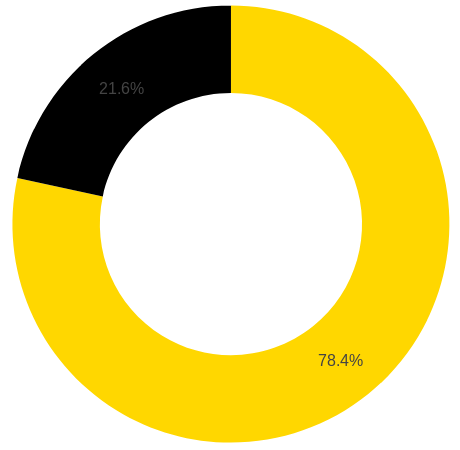

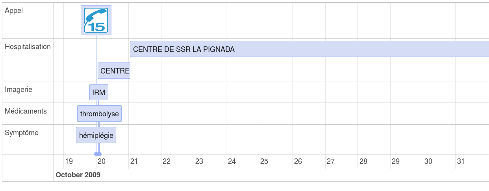


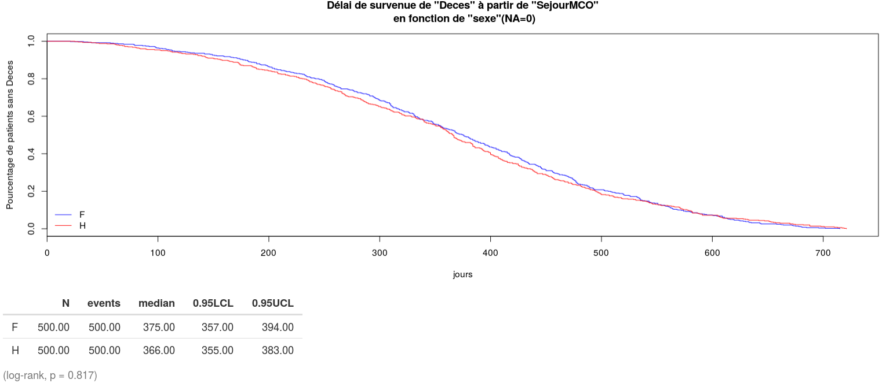


## Indépendant de la source de données
La deuxième partie du défi (juin - octobre) a été consacrée au développement d'un modèle générique de données pour intégrer tout type de données parcours. 

<!-- Un évènement peut être décrit par un nombre indéfini de caractéristiques. Au minimum, un évènement a pour seule caractéristique une date de début.  -->
<!-- Une hospitalisation dans le PMSI possède de très nombreuses caractéristiques :  -->

<!-- * Diagnostic principal codé dans une terminologie (hiérarchie de codes) -->
<!-- * Diagnostics associés codés dans la même terminologie mais avec une relation est de 0 à N (une hospitalisation possède 0 ou plusieurs diagnostics associés).  -->
<!-- * Des actes médicaux codés dans une autre terminologie (si nous avions la date de ces actes, ils seraient considérés comme des évènements) -->
<!-- * Un établissement qui possède plusieurs caractéristiques : une région, un département, une raison sociale, des coordonnées géographiques. Le département décrivant l'établissement possède lui aussi plusieurs caractéristiques : un nom, une surface géographique, un nombre d'habitants ... -->

Une ontologie est utilisée pour décrire les évènements et leurs caractéristiques. L'ontologie est utilisée comme schéma d'intégration et elle sera aussi utilisée par l'interface de datavisualisation pour choisir le graphique adapté. Le logiciel [Protégé](http://protege.stanford.edu/) fournit une interface graphique pour créer une ontologie. La principale ontologie est l'ontologie des évènements. Elle décrit la hiérarchie des évènements (séjour hospitalier, consultation...). Chaque évènement est une sous-classe de la classe "Event" qui est la classe parente. 
Lorsqu'un évènement est lié à une autre ressource (établissement, code CIM-10...), cette ressource doit être décrite dans sa propre ontologie.  

Les données sont des instances de ces classes. Une hospitalisation d'une personne est une instance de la classe "SejourHospitalier". Un établissement de santé (ex : CHU de Bordeaux) correspond une instance de la classe "Etablissement". La relation "inEtab", décrite ci-dessous, permet de faire un lien entre ces deux instances. 

Les relations (ou propriétés ou prédicats) permettent de décrire des ressources. Elle sont de 2 types :

* objectProperty : elles réalisent un lien entre deux ressources, par exemple entre une hospitalisation et un établissement.

* dataProperty : elles réalisent un lien entre une ressource et une valeur : chaîne de caractères, date, numérique...

```{eval=FALSE}
<http://www.eigsante2017.fr#inEtab> a owl:ObjectProperty ;
	rdfs:domain <http://www.eigsante2017.fr#SejourHospitalier> ;
	rdfs:range <https://www.data.gouv.fr/FINESS#Etablissement> ;
	rdfs:comment "characteristics of the institutions"@en , "variables décrivant l'établissement"@fr ;
	rdfs:label "healthcare institutions"@en , "établissement de santé"@fr .
```

Une traduction de cette description en langage naturel serait : la relation "inEtab" est de type objectProperty et réalise un lien entre un "SejourHospitalier" et un "Etablissement", le libellé de cette relation est "établissement de santé" en français et "healthcare institutions" en anglais. 

Une classe possède ses propres relations et hérite des relations de ses classes parentes. Comme la classe "Event" est la classe parente de toutes les autres dans l'ontologie des évènements et qu'elle possède la relation "hasBeginning", toutes les classes filles possèdent cette relation. 

### Lien entre ontologie et base de données

Pour faire une analogie avec le modèle de bases de données relationnelles, une ontologie correspond au schéma d'une table. L'ontologie décrit le modèle d'une base de données orientée graphe. 
Elle est utilisée par le programme d'intégration pour garantir la cohérence interne. Par exemple, il n'est pas possible de faire un lien entre une hospitalisation et l'établissement "CHU de Bordeaux" si ce dernier n'est pas déclaré. Pour faire une analogie avec le modèle relationnel, il s'agit d'une contrainte de clé étrangère. 

### Lien entre ontologie et interface

L'interface récupère les relations décrites dans l'ontologie pour permettre à l'utlisateur de filtrer les évènements. Par exemple, ci-dessous, l'utilisateur a sélectionné l'évènement "SejourSSR" et l'interface propose 6 propriétés. En gras figure le libellé (rdfs:label) de la relation et entre parenthèse le commentaire (rdfs:comment). La relation "inEtab" décrite plus haut est située en dernière position.   

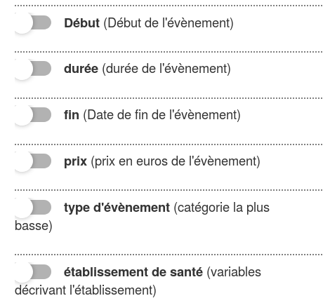

Si l'utilisateur clique sur une propriété de type "dataProperty", l'interface fournit une datavisualisation adaptée à la nature de la donnée (voir plus bas). 
Si l'utilisateur clique sur une propriété de type "objectProperty", l'interface fournit la liste des propriétés de la nouvelle ressource à décrire. 

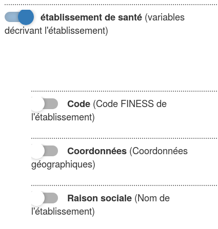

### Lien entre ontologie et datavisualisation
L'interface utilise la description des propriétés des ontologies pour savoir quel graphique afficher quand l'utilisateur veut filtrer une relation de type "dataProperty". Par exemple, le "prix" est une propriété d'une hospitalisation. La valeur attendue est une valeur numérique d'après l'ontologie. En cliquant sur le prix, l'interface propose un scatterplot.

Au total, l'interface est capable de proposer 7 filtres différents pour filtrer 7 types de données : 

1. Numérique

L'utilisateur a le choix entre un scatterplot ou un boxplot.
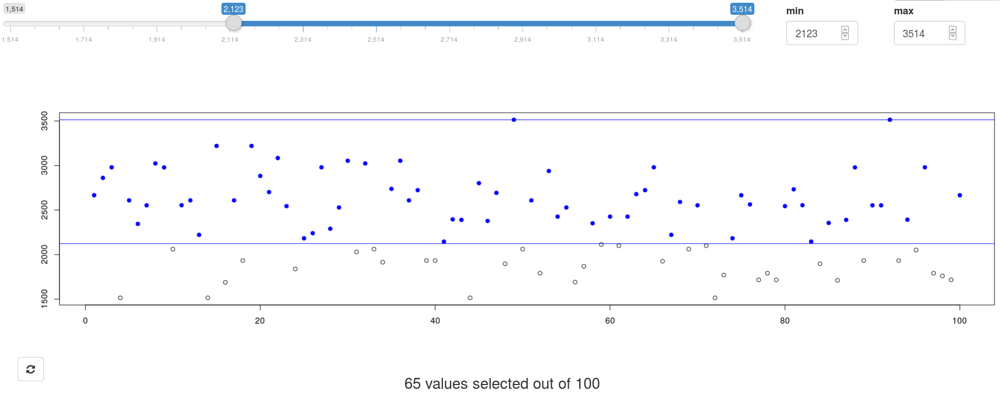

2. Durée

Il s'agit d'une extension du type numérique où l'utilisateur peut choisir l'unité de temps. 
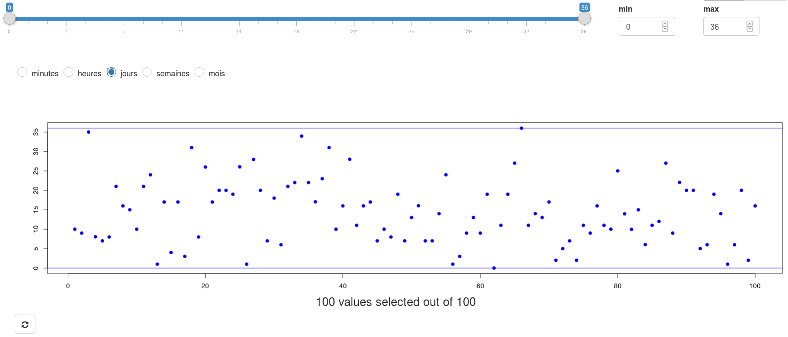

3. Catégorielle

L'utilisateur a le choix entre un pie-chart ou un barplot. 
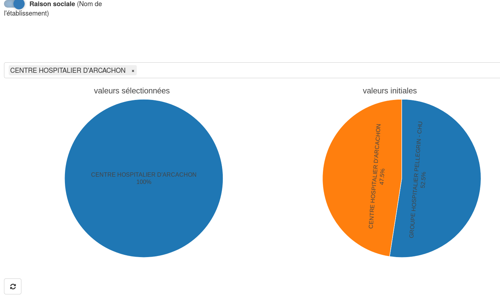

4. Hiérarchique

L'utilisateur a le choix entre un sunburst ou un arbre hiérarchique.  
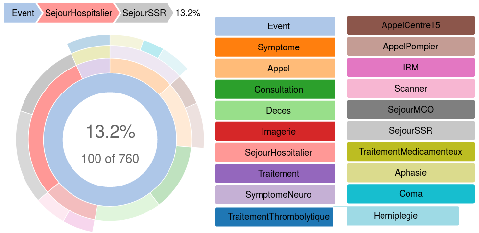

5. Date

Pour sélectionner des dates, l'utilisateur a le choix entre une sélection sur le graphique ou via un calendrier. 
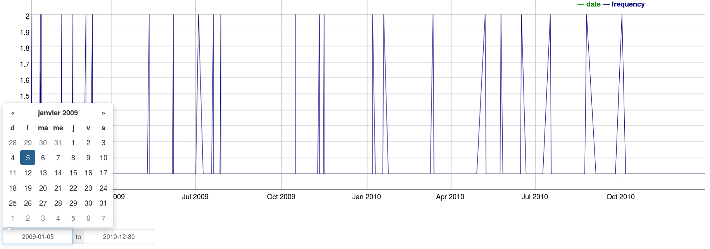

6. Coordonnées géographiques

Toute entité géolocalisée peut être sélectionnée sur une carte. 
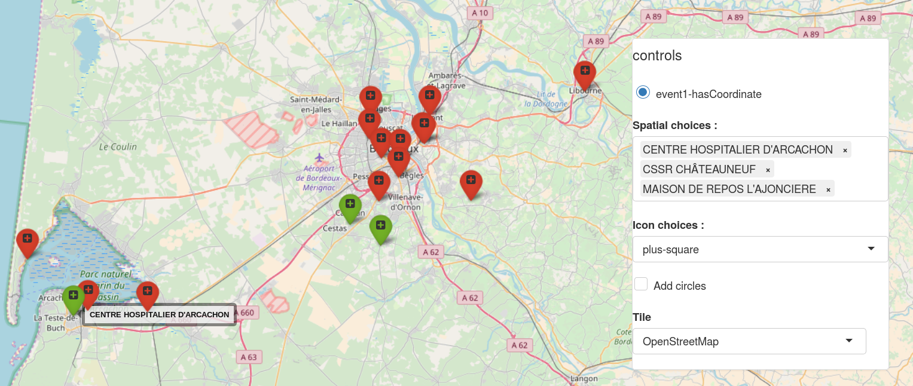

7. Couches géographiques

Pour sélectionner une surface géographique (département, commune ...) l'utilisateur utilise la carte. 
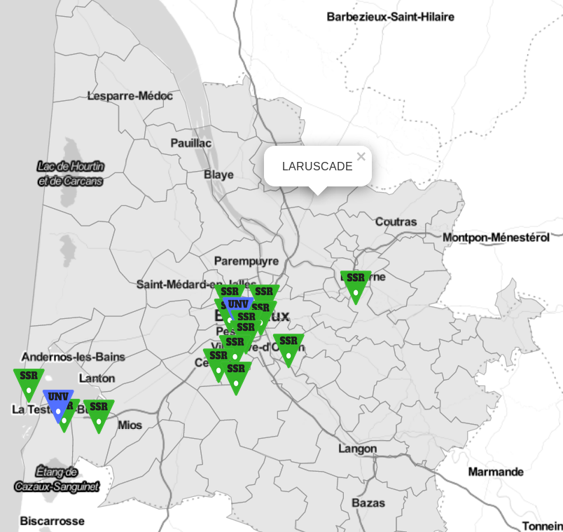

Chaque type de données peut être représenté par différents graphiques. Par exemple, il existe au moins trois façons de visualiser une hiérarchie : un "sunburst", un arbre et un "treemap". Le code développé en R est modulaire pour permettre de changer de visualisation. 


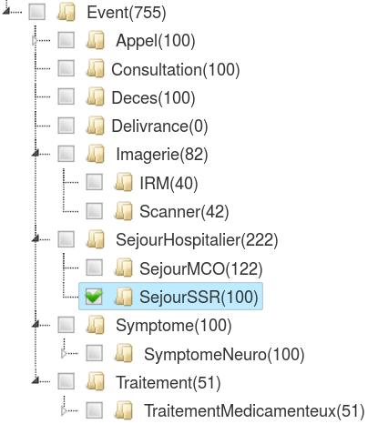

Un bouton permet de passer d'un sunburst (visualisation de la hiérarchie par couches concentriques) à un arbre. Les deux graphiques ci-dessus contiennent exactement les mêmes données (bug : SunBurst arrondit à la dizaine supérieure ce qui explique la différence entre 760 et 755). Par manque de temps, je n'ai pas été plus en profondeur sur la datavisualisation. Il est possible d'ajouter des boutons pour paramétrer chaque graphique sans trop de difficultés. Je n'ai pas du tout abordé l'expérience utilisateur.
Le temps a surtout été dépensé sur l'articulation entre les différents graphiques. 

En résumé, l'application est capable d'intégrer et de manipuler tout type de données "parcours". Pour ajouter des évènements, la première étape est de définir ceux-ci dans une ontologie et de décrire leurs caractéristiques. Les données peuvent ensuite être importées en base de données (un post décrira cette étape). L'interface est en mesure de proposer la sélection de ce nouveau type d'évènement et de proposer un filtre adapté à chaque propriété. 

## Explorer les données

Cette section explique comment les données sont organisées dans la base de données et pourquoi une base de données orientée graphe fournit plus d'avantages qu'un modèle relationnel pour rechercher des séquences d'évènements.

Tous les évènements d'un parcours de soins d'un individu sont regroupés dans un seul fichier puis chargés dans une base de données graphe ([Blazegraph](https://www.blazegraph.com/)). En base de données, chaque parcours correspond à un sous-graphe, appelé "NamedGraph". Lors de la recherche de séquences d'évènements, la base de données graphe recherche sous-graphe par sous-graphe, c'est-à-dire parcours par parcours. Cette répartition en silos améliore les performances. Chaque sous-graphe possède des caractéristiques (ex : sexe du patient, département de résidence...). 

Les données sont interrogées en SPARQL, langage proche du SQL. Alors que pour une base de données relationnelle il serait nécessaire de réaliser un grand nombre de jointures pour chercher des liens entre les évènements, la requête est beaucoup plus simple à créer pour une base de données orientée graphe.

Pour rechercher des séquences temporelles le logiciel EventFlow utilise une approche par programmation linéaire en nombres entiers (Integer Programming approach), d'après [Megan Monroe](http://hcil2.cs.umd.edu/trs/2014-17/2014-17.pdf). 
Une approche par base de données graphe est une solution alternative proposée ici. Une requête SPARQL permet de recherche des motifs séquentiels d'évènements dans un graphe. 
Cette requête est générée par un programme Java qui transforme la requête d'un utilisateur sur l'interface graphique en SPARQL.

Le diagramme ci-dessous montre les trois principaux composants de l'application. 

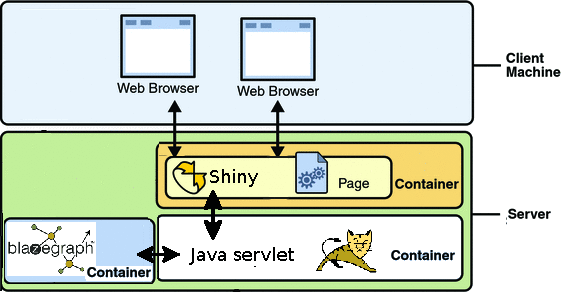

Le serveur web contient 3 conteneurs docker : 

* Un serveur Shiny : le client interagit seulement avec celui-ci qui lui fournit l'interface web.
* Une servlet. Son rôle est de fournir à Shiny toutes les données dont il a besoin pour son fonctionnement : description des ontologies, hiérarchies de classes, données sur les évènements. 
* La base de données graphe

Le workflow est le suivant : lorsque Shiny a besoin de données sur des évènements, il communique avec le servlet via une API développée spécifiquement pour cette application. Shiny transforme la requête d'un utilisateur en fichier XML qu'il transmet au servlet. Celui-ci transforme ce fichier en requête SPARQL qu'il envoie à la base de données graphe. Celle-ci recherche des motifs dans les sous-graphes (parcours de soins) et transmet les résultats au servlet. Ce dernier sérialise les résultats et les transmet à Shiny. 


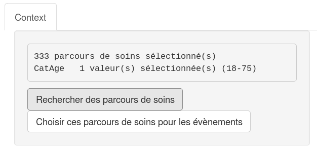

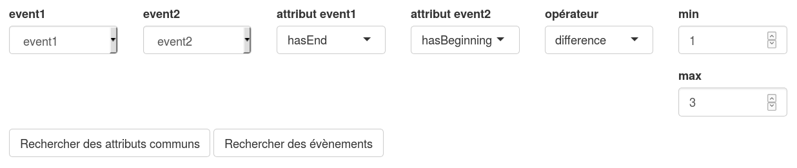


La requête SPARQL générée automatiquement est la suivante :
```
SELECT ?context ?event1 ?event1hasNum ?event2 ?event2hasNum  WHERE {graph ?context {
?event1 <http://www.w3.org/1999/02/22-rdf-syntax-ns#type> <http://www.eigsante2017.fr#SejourMCO> .
?event1 <http://www.eigsante2017.fr#inEtab> ?event1inEtab .
?event1 <http://www.eigsante2017.fr#hasEnd> ?event1hasEnd .
?event1 <http://www.eigsante2017.fr#hasNum> ?event1hasNum .
?event2 <http://www.w3.org/1999/02/22-rdf-syntax-ns#type> <http://www.eigsante2017.fr#SejourSSR> .
?event2 <http://www.eigsante2017.fr#hasBeginning> ?event2hasBeginning .
?event2 <http://www.eigsante2017.fr#hasNum> ?event2hasNum .
bind ((?event2hasBeginning - ?event1hasEnd) as ?diffevent2hasBeginningevent1hasEnd)
VALUES (?event1inEtab) {(<https://www.data.gouv.fr/FINESS#Etablissement330781360>) }
FILTER (?diffevent2hasBeginningevent1hasEnd >= 1.0 && ?diffevent2hasBeginningevent1hasEnd <= 3.0)
}}
```

La ligne "bind" crée un nouveau lien à la volée correspondant à la différence entre deux dates.  
Un système de cache enregistre les résultats des requêtes déjà réalisées. Si la requête a déjà été exécutée, elle n'est pas transmise à la base de données, le fichier est directement transmis à Shiny. 


Il n'est pas nécessaire de développer un programme spécifique pour la recherche de séquences d'évènements. La base de données orientée graphe réalise cette tâche elle-même.

D'un point de vue sécurité, cette configuration est intéressante car la base de données et le servlet ne communiquent pas avec le monde extérieur. La base de données communique uniquement avec le servlet et ce dernier communique uniquement avec l'application Shiny. 

D'un point de vue scalabilité, cette configuration est aussi intéressante. Comme les parcours de soins sont indépendants les uns des autres et que les recherches se déroulent sous-graphe par sous-graphe, il est possible de partitionner la base de données et de la répartir sur plusieurs serveurs. Par exemple, au lieu d'avoir une seule base de données de 500 000 parcours de soins, il suffit de la découper en 10 bases de données de 50 000 parcours. 


# Etat d'avancement

L'interface de recherche de séquences d'évènements fonctionne sur un petit jeu de données simulées. Vous pouvez la tester [ici](http://91.121.106.228:3838/V5/). 
Les outils d'analyse des évènements (timeline, diagramme de Sankey, analyse comparative et prédictive), présents dans les versions 3 et 4, doivent être incorporés. Les deux derniers mois du défi (octobre - novembre) seront consacrés à cette tâche et à la documentation du code de l'application. 