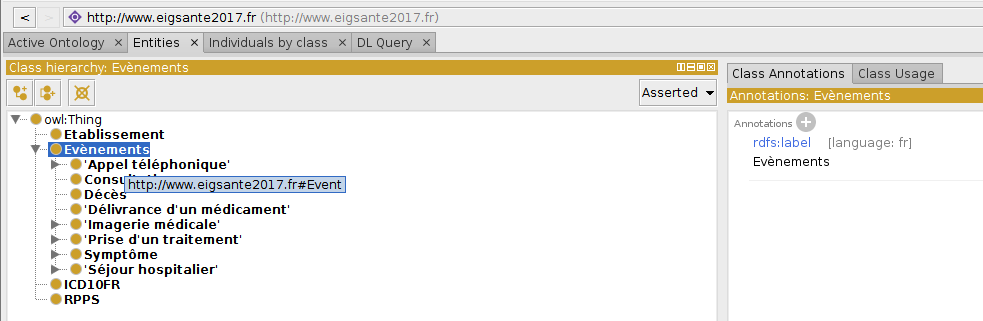
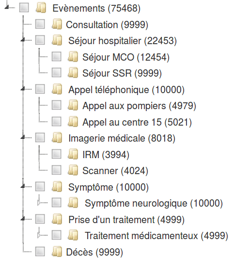
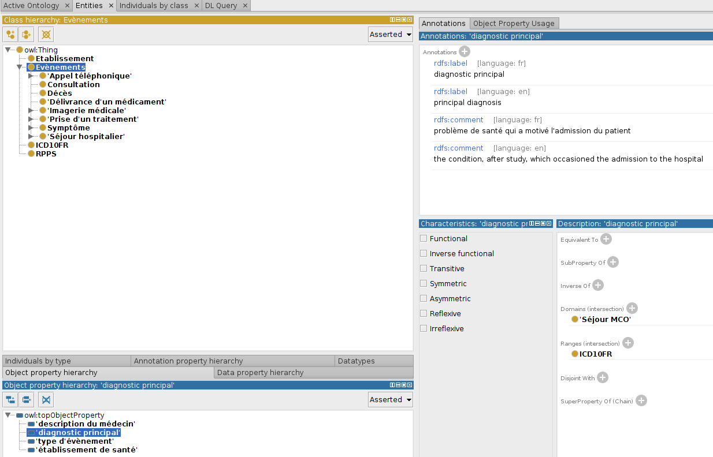
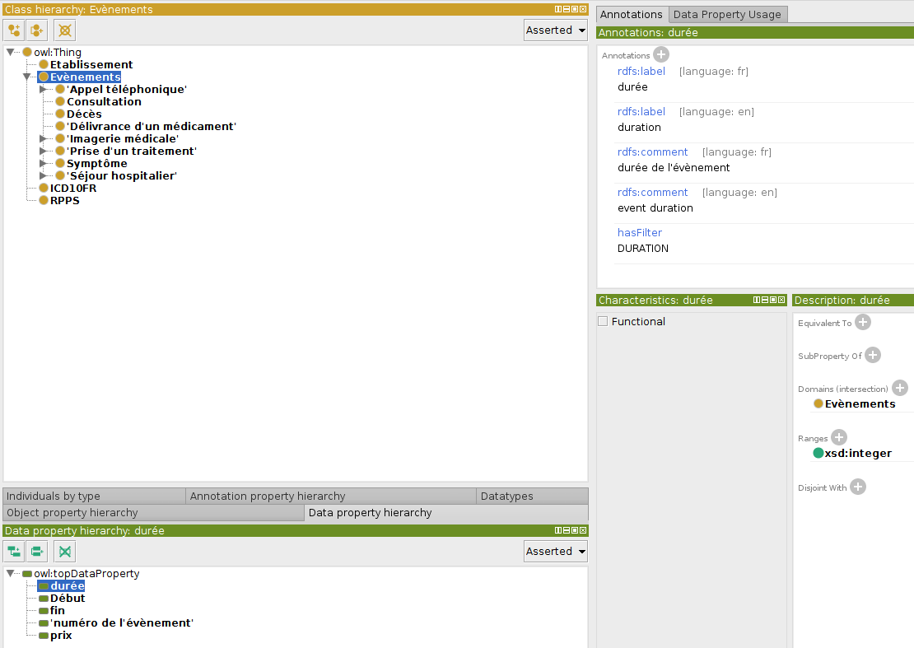
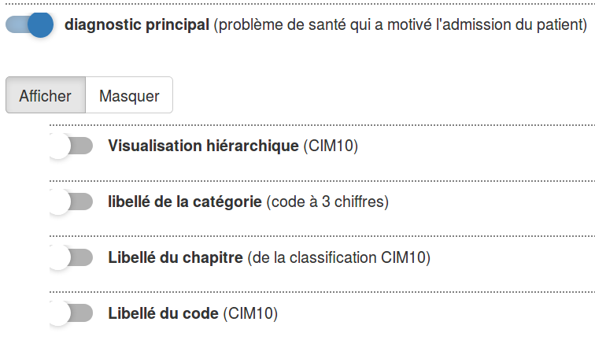
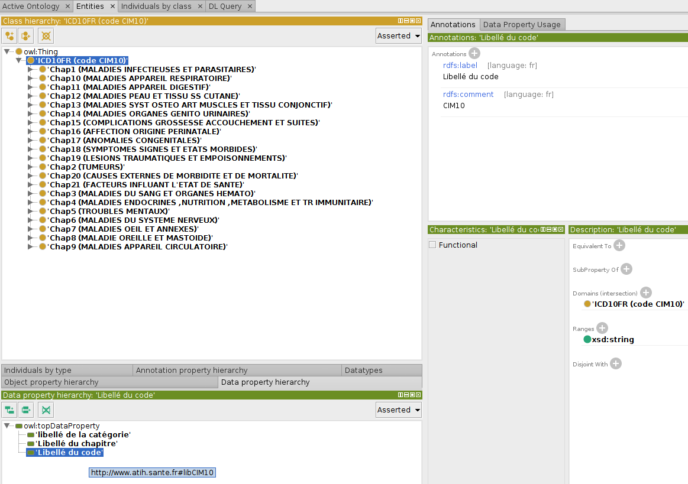
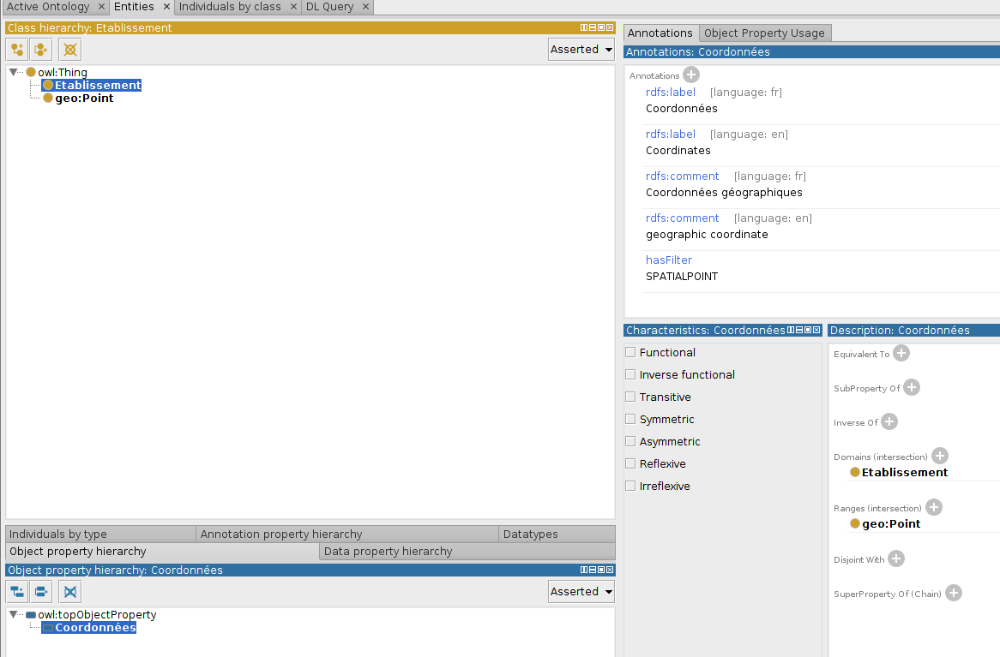
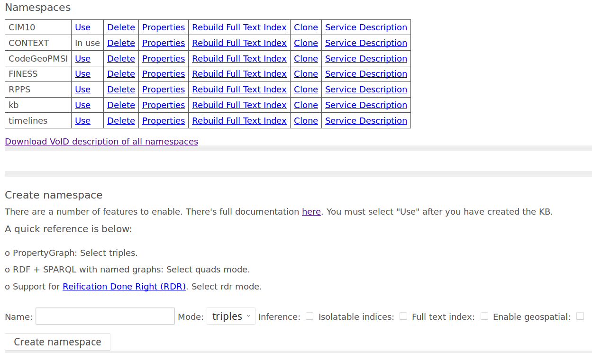

<style type="text/css">

body{ /* Normal  */
   font-size: 1.75em;
   /*max-width: 1100px;*/
   margin: auto;
}

.main-container{
max-width: 80%;
}

h1.title { /* Header 1 */
 font-size: 3em;
 color: DarkBlue;
 text-align:center;
}

h4.date {
 text-align:center;
}

h1 { /* Header 2 */
 
 font-size: 1.7em;
 color: DarkBlue;
 text-align:center;
 margin-top:100px;
 margin-bottom:50px;
}

h2 { /* Header 3 */
 font-size: 1.5em;
 color: #0072c6;
 margin-left:40px;
}

h3 { /* Header 3 */
 font-size: 1.1em;
 color: #0c813c;
 margin-left:80px;
}


h4 { /* Header 3 */
 font-size: 1.8em;
 color: black;
 margin-left:60px;
}


img{
display: block;
margin-left: auto;
margin-right: auto 
}

</style>

Dans ce post, j'explique comment intégrer des données et lancer l'application.

# Pré-configuration
## Installations nécessaires
1) R - Rstudio - tous les packages utilisés dans la version V5 (voir global.R)
2) Java (JDK-JRE) - Eclipse
3) Maven
4) Docker
5) Protégé (facultatif, pour la création d'ontologies)

# Rappel sur le fonctionnement

## Différentes versions
Les versions 1 à 4 sont des prototypes RShiny standalone. Ceux-ci avaient pour objectif de tester différentes bibliothèques javascript et de montrer aux utilisateurs différentes datavisualisations pour affiner le besoin en visualisation. Ces prototypes se lancent comme une application RShiny classique. Pour toute application RShiny, il faudra d'abord installer les libraires nécessaires. Il est possible que ces prototypes ne fonctionnent plus suite à une mise-à-jour de librairies. Je ne maintiens plus les prototypes 1 à 4. 

La version 5 est la version définitive. Elle est composée de 3 modules : 


1) Une base de données graphe (Blazegraph)
2) Une servlet (moteur Apache-Tomcat)
3) Datavisualisation avec RShiny

Ces modules sont dockerisés. 

## Fonctionnement V5 
Lorsque l'utilisateur interagit avec l'interface graphique ou réalise une requête temporelle (combien de réhospitalisations après une fracture du fémur ?), des classes R transforment les demandes de l'utilisateur en fichiers XML. Ces fichiers sont transmis à une servlet (HTTP POST). La servlet transforme un fichier XML en requête SPARQL qui est transmise au triplestore (Blazegraph). Les résultats de cette requête sont sérialisées et transmis à RShiny. 
<!-- RShiny demande aussi au servlet des informations sur les terminologies (nom de la terminologie, principale classe, hiérarchies, prédicats, label, expected value) via des requêtes HTTP GET. RShiny ne stocke aucune donnée (sauf les fichiers shapeFile, j'y reviendrai).  -->

Les requêtes SPARQL sont générées à la volée et sont agénériques d'un schéma de bases de données pré-établi. Tout nouveau projet doit définir le schéma de la base de données via des ontologies OWL.  

# Définir les ontologies (schéma du triplestore)
Les ontologies décrivent le contenu de la base de données graphe et sont créées pour permettre d'intégrer de nouvelles données. 
Commencer par créer un dossier "nom_du_projet" dans /src/main/resources (projet Maven). Dans ce dossier, il faudra configurer un fichier XML décrivant les différentes ontologies/terminologies, j'y reviendrai. 

Le logiciel [Protégé](http://protege.stanford.edu/) fournit une interface graphique pour créer une ontologie. Je vous conseille de l'utiliser. La principale ontologie est l'ontologie des évènements. Les ontologies sont à placer dans un dossier portant leur nom. Par exemple, l'ontologie "Event" est rangée dans /src/main/resources/AVC/Event pour le projet AVC. 

## Ontologie des évènements
Cette ontologie est indispensable. 
Elle décrit la hiérarchie des évènements (séjour hospitalier, consultation...). Chaque évènement est une sous-classe de la classe "Event" qui est la classe parente. 



La classe principale est http://www.eigsante2017.fr#Event. 
Chaque classe possède un libellé définit avec un rdfs:label. 
Important! Si une hiérarchie de classes doit être affichée (CIM10, Evènements), il est nécessaire de fournir un libellé de la classe avec rdfs:label. Ce sont ces libellés qui seront transmis à RShiny au moment de la datavisualisation : 



L'interface affiche le libellé rdfs:label définit dans l'ontologie des évènements 
(entre parenthèses est ajouté le nombre d'instances de chaque classe, calculé par la servlet).  
L'ontologie des évènements décrit l'ensemble des évènements qu'un utilisateur pourra sélectionner. 
Elle décrit aussi l'ensemble des évènements qu'il sera possible d'intégrer à la base de données, j'y reviendrai. 

Nous voyons 3 autres classes OWL qui ne sont pas une subClassOf de http://www.eigsante2017.fr#Event : 

1) Etablissement
2) ICD10FR
3) RPPS

Il s'agit des classes principales de 3 autres terminologies qui, pour plus de clarté, sont définies dans un fichier OWL séparé. 
Si ces classes apparaissent ici, c'est qu'il existe une relation avec une classe Event. 
Par exemple : 


La relation http://www.eigsante2017.fr#hasDP a pour domaine "SejourMCO" et pour portée "ICD10FR". Ceci signifie qu'il est possible de définir un triplet : "instance_Sejour_MCO" http://www.eigsante2017.fr#hasDP "instance_ICD10FR" ; et que l'utilisateur pourra filtrer les "SejourMCO" selon leur code CIM10. 

Important! Chaque relation dans toute terminologie doit avoir un rdfs:label et un rdfs:comment. Si ce n'est pas le cas, la relation ne sera pas proposée à l'utilisateur (les relations sans rdfs:label sont des relations "privées" en quelque sorte, pour faire une analogie avec la programme OO).  
La datavisualisation utilise les relations rdfs:label et rdfs:comment pour afficher les relations et pour permettre à un utilisateur de filtrer un évènement selon ses caractéristiques : 


Sur l'interface de datavisualisation, en gras s'affiche le rdfs:label et entre parenthèses le rdfs:comment. 
Dans la hiérarchie des évènements, chaque évènement hérite des relations de ses parents. Par exemple, la relation http://www.eigsante2017.fr#hasDuration a pour domaine "Event" et pour portée "xsd:dateTime". Ceci signifie qu'il est possible de définir une durée pour tout évènement (SejourMCO, Consultation...). Ceci n'implique pas qu'une valeur est obligatoire. 

Il serait possible de définir dans l'ontologie des cardinalités. Par exemple, un séjour MCO ne peut avoir qu'un seul diagnostic principal alors qu'il peut avoir plusieurs diagnostics associés. Je n'ai pas implémenté la vérification de la cardinalité donc il est inutile de définir des cardinalités pour le moment.   



## hasFilter
Nous voyons que la relation http://www.eigsante2017.fr#hasDuration est décrite par  http://www.eigsante2017.fr#hasFilter "DURATION".
Il s'agit d'une relation pour définir le type de "filtre" à afficher au moment de la datavisualisation.
Les différentes valeurs possibles sont décrites dans la classe Java "PredicateDescription.java" sous forme d'énumération : 
```{java eval=F, include=T}
	public enum ValueCategory {
		NUMERIC, DURATION, DATE, STRING, HIERARCHY, TERMINOLOGY, SPATIALPOLYGON, SPATIALPOINT;
	}
```
Les catégories NUMERIC, DATE, STRING et TERMINOLOGY n'ont pas besoin d'être spécifiées dans une ontologie car ils sont inférés automatiquement quand :

1) La relation est une owl:DatatypeProperty et la portée est de type numérique (integer, double...) alors la catégorie est NUMERIC
2) La relation est une owl:DatatypeProperty et la portée est de type date alors la catégorie est DATE
3) La relation est une owl:DatatypeProperty et la portée est de type String alors la catégorie est STRING
4) La relation est une owl:ObjectProperty alors la catégorie est TERMINOLOGY

### DURATION
http://www.eigsante2017.fr#hasDuration a pour portée xsd:integer (voir ci-dessus), la catégorie inférée par le code Java sera NUMERIC. Mais si on définit dans l'ontologie http://www.eigsante2017.fr#hasFilter "DURATION" alors la catégorie sera DURATION et la datavisualisation sera adaptée à une durée (possibilité de choisir : secondes, minutes, heures, semaines, mois). 

### HIERARCHY 
TERMINOLOGY est la catégorie inférée par défaut lorsque la relation est une owl:ObjectProperty. 



Par exemple,  http://www.eigsante2017.fr#hasDP  ("diagnostic principal") est une owl-ObjectProperty. Sa catégorie inférée est TERMINOLOGY. Quand un utilisateur clique sur ce type de relation sur l'interface, RShiny va afficher les attributs de la classe principale de cette terminologie (ICD10FR) définits dans sa propre ontologie : 



Nous voyons que l'interface affiche les relations décrites dans l'ontologie. 

"Visualisation hiérarchique" est une relation de type object-property qui http://www.eigsante2017.fr#hasFilter "HIERARCHY". Quand l'utilisateur clique sur cette relation, l'interface sait qu'il doit afficher une hiérarchie, RShiny envoie une requête HTTP GET à la servlet pour obtenir cette hiérarchie.
Le logiciel ne gère pas d'autres formats (SKOS par exemple). Pour une hiérarchie, il faut que des OWL:class avec des relations subClassOf et chaque OWL:class doit posséder son rdfs:label pour afficher le libellé sur l'interface graphique. La hiérarchie peut être multi-axiale (ATC par exemple). 

### SPATIALPOINT
La relation suivante possède ce type de filtre : 



Important! Pour définir des spatialPoint, il est nécessaire que la classe cible (geo:Point ici) possède 3 attributs :

1) lat de type float (latitude dans le référentiel WGS84)
2) long de type float (longitude dans le référentiel WGS84)
3) label de type string (libellé à afficher sur la carte => sera concaténé avec le nombre d'instances par RShiny ensuite)

Concrètement, RShiny reçoit l'ensemble des instances geo:Point lorsque l'utilisateur demande les coordonnées d'un établissement par exemple, comme la catégorie est "SPATIALPOINT", RShiny demande les informations ci-dessus (lat, long, label => codés en dur !) de ces instances geo:Point et les affiche sur la carte. 

### SPATIALPOLYGON
La relation suivante possède ce type de filtre : 


Important! Pour définir des spatialPolygon, il est nécessaire que la classe cible possède 2 attributs (aussi codés en dur dans R) :

1) layerId (le même layerId est attendu dans les métadonnées du shapeFile)
2) shapeFile (le nom du fichier shp)

J'ai décidé de placer les fichiers shp dans le dossier shapeFiles dans RShiny. Le fichier est déjà préparé (.rdata) à être chargé dans R et les métadonnées contiennent deux colonnes importantes : layerId (faisant les liens avec le layerId décrit au dessus) et label (libellé du polygone sur la carte). L'autre solution aurait été de mettre ce fichier sur le serveur et l'interface le demande par requête. 

## Ontologie Graph
Cette ontologie est aussi indispensable même si elle peut être vide. Elle décrit des attributs patient contrairement à l'ontologie Event qui décrit des attributs évènements.
Chaque parcours de soins est un "NamedGraph" dans le triplestore. Chaque NameGraph est indépendant les uns des autres. Une requête s'applique sur un ensemble de NamedGraph, elle s'exécute NamedGraph par NamedGraph. Les parcours sont "cloisonnés" en base de de données. Pour choisir sur quels NamedGraph appliquer notre requête, l'utilisateur peut choisir de filtrer selon des attributs patients. Ces attributs sont indépendants d'un évènement, ils concernent un patient. Par exemple : son sexe, son département de résidence, son âge. Age et département de résidence peuvent changer au cours du temps (même le sexe, on peut imaginer !) mais ça ne pose pas de problèmes car les relations peuvent être de 1 à n. Par exemple, lorsque l'utilisateur choisit le département de la Gironde comme attribut patient, la demande est : "tous les NamedGraph des patients habitant ou ayant habités en Gironde". Certains attributs peuvent très bien être à la fois patient et évènements. Sur l'ensemble d'un parcours de soins, un patient peut avoir 1 à n départements de résidence mais pour un évènement, il n'en aura qu'un seul.  

## terminologies.xml
Il s'agit du fichier décrivant toutes les terminologies d'un projet. Ce fichier doit être présent à la racine du projet. 


```{r eval=F}
<?xml version="1.0"?>
<!DOCTYPE terminologies SYSTEM "terminologies.dtd" > 
<terminologies>
	  <!-- FINESS -->
	<terminology>
		<terminologyName>Etablissement</terminologyName>
		<namespace>https://www.data.gouv.fr/FINESS#</namespace>
		<prefix>datagouv</prefix>
		<className>Etablissement</className>
		<ontologyFileName>FINESS-ontology.owl</ontologyFileName>
		<dataFileName>FINESS33.ttl</dataFileName>
		<endpoint>/bigdata/namespace/FINESS/sparql</endpoint>
	</terminology>
		  
	<terminology>
		<terminologyName>RPPS</terminologyName>
		<namespace>http://esante.gouv.fr#</namespace>
		<prefix>asip</prefix>
		<className>RPPS</className>
		<ontologyFileName>RPPS-ontology.owl</ontologyFileName>
		<dataFileName>RPPS.ttl</dataFileName>
		<endpoint>/bigdata/namespace/RPPS/sparql</endpoint>
	</terminology>
	
	
	<!-- Context -->
	<terminology>
		<terminologyName>Graph</terminologyName>
		<namespace>http://www.eigsante2017.fr#</namespace>
		<prefix>eig</prefix>
		<className>Graph</className>
		<ontologyFileName>Context-ontology.owl</ontologyFileName>
		<dataFileName>CONTEXT.ttl</dataFileName>
		<endpoint>/bigdata/namespace/CONTEXT/sparql</endpoint>
	</terminology>
	
	<!-- CIM10 -->
	
	<terminology>
		<terminologyName>CIM10</terminologyName>
		<namespace>http://www.atih.sante.fr#</namespace>
		<prefix>atih</prefix>
		<className>ICD10FR</className>
		<ontologyFileName>CIM10-ontology.owl</ontologyFileName>
		<dataFileName>InstancesCIM10.ttl</dataFileName>
		<endpoint>/bigdata/namespace/CIM10/sparql</endpoint>
	</terminology>
	
	<terminology>
		<terminologyName>Event</terminologyName>
		<namespace>http://www.eigsante2017.fr#</namespace>
		<prefix>eig</prefix>
		<className>Event</className>
		<ontologyFileName>events-ontology.owl</ontologyFileName>
		<dataFileName></dataFileName>
		<endpoint>/bigdata/namespace/timelines/sparql</endpoint>
	</terminology>
	
	<terminology>
		<terminologyName>CodeGeoPMSI</terminologyName>
		<namespace>https://www.atlasante.fr/GEOPMSI2014#</namespace>
		<prefix>atlasante</prefix>
		<className>PolygonCodeGeoPMSI</className>
		<ontologyFileName>codeGeoPMSI-ontology.owl</ontologyFileName>
		<dataFileName>terminoGeo.ttl</dataFileName>
		<endpoint>/bigdata/namespace/CodeGeoPMSI/sparql</endpoint>
	</terminology>
	
</terminologies>
```

Important! Ce fichier doit être construit au fur et à mesure de la construction des ontologies pour éviter de se tromper (namespace, prefix...). Il faut s'assurer que les namespaces de l'ontologie correspondent bien aux namespaces décrits dans ce fichier. 

1) TerminologyName : Nom de la terminologie ; 2 terminologies sont obligatoires : Graph et Event (merci de garder ces noms)
2) Namespace
3) Prefix
4) className : nom de la classe principale de la terminologie
5) ontologyFileName : nom du fichier OWL décrivant la terminologie (format attendu : TURTLE, voir Util.Java pour changer)
6) dataFileName : nom du fichier contenant les instances (format attendu : TURTLE, voir Util.Java pour changer)
7) endpoint : on s'attend à une base de données Blazegraph. Il s'agit toujours du même pattern : /bigdata/namespace/NS/sparql où NS est un namespace où on place des triplets RDF. 

La terminologie Event a son champ "dataFileName" vide. J'explique pourquoi plus bas dans la section sur l'importation des données.
Important! Il faut créer un dossier par terminologie à placer dans le dossier du projet (voir l'exemple de l'AVC dans /src/main/resources). Les fichiers attendus de chaque terminologie sont à placer dans leur dossier respectif.  

## Project.java
Ce fichier java contient 3 variables : 
```{r eval=F}
	public final static String projectFolder = "AVC/";
	public static final String dbName = "BlazegraphDB";
	public static final String dbAlias = dbName ; 
```
projectFolder : le nom du dossier projet dans /src/main/resources

dbName : nom du container docker (j'y reviendrai)

dbAlias : alias du nom du container (j'y reviendrai)

Cette configuration permet de changer de projet rapidement. En changeant le fichier Project.java, la servlet charge un nouveau fichier terminologies.xml donc de nouvelles terminologies et elle sait ou trouver le container docker contenant les données d'un autre projet avec dbName (j'y reviendrai plus bas). L'interface RShiny communique qu'avec la servlet, elle est indépendante de la base de données et du type de projet. Au démarrage, RShiny demande à la servlet des informations sur les terminologies. C'est une architecture de type MVC(model-view-controller). 

# Importer des données (phase ETL)
L'importation des données des évènements est différente de l'importation des autres terminologies (Graph, etc...). Les données en entrées sont toutes au format texte (csv) et sont transformées en fichiers RDF puis chargées dans le triplestore. 
Les autres terminologies doivent être intégrées AVANT l'intégration des évènements car le programme vérifie la cohérence des déclarations. 
Par exemple, le triplet suivant : "instance_de_sejourMCO" hasDP "I50+21" ; sera rejetté si "I50+21" n'est pas une instance de codes CIM10 ou si la relation hasDP n'est définie dans l'ontologie. Le programme d'importation s'attend à un code CIM10 car la portée de la relation hasDP est un code CIM10 (définit dans l'ontologie) et il interroge la terminologie pour vérifie que ce code existe bien. Si ce code n'existe pas, il enregistre ce rejet dans un fichier (avec le message d'erreur) et passe à la ligne suivante. 

## Importation des terminologies
### CSV2RDF
J'utilise l'outil [CSV2RDF](https://github.com/clarkparsia/csv2rdf.git) pour transformer un CSV d'une terminologie en RDF. L'outil est très facile d'utilisation. 
Par exemple, pour les GHM, le fichier CSV est constitué de 9 variables : 

1) code
2) libGHM
3) ASO
4) DA
5) libDA
6) GP
7) libGP
8) GA
9) libGA

CSV2RDF demande de créer un "template". Ce template doit concordé avec l'ontologie de cette terminologie. 

```{r eval=F}
@prefix dc: <http://purl.org/dc/elements/1.1/> .
@prefix xsd: <http://www.w3.org/2001/XMLSchema#> .
@prefix rdfs: <http://www.w3.org/2000/01/rdf-schema#> .
@prefix atih: <http://www.atih.sante.fr#> .

atih:${code} a atih:GHM ;
	atih:hasGHM "${code}"^^xsd:string ;
	atih:libGHM "${libGHM}"^^xsd:string ;
	atih:ASO "${ASO}"^^xsd:string ;
	atih:DA "${DA}"^^xsd:string ;
	atih:libDA "${libDA}"^^xsd:string ;
	atih:GP "${GP}"^^xsd:string ;
	atih:libGP "${libGP}"^^xsd:string ;
	atih:GA "${GA}"^^xsd:string ;
	atih:libGA "${libGA}"^^xsd:string .
```

J'ai donné arbitrairement le prefix atih: et le namespace http://www.atih.sante.fr# afin de me souvenir de la source de ce fichier. Il faut ensuite lancer le jar en lui donnant le fichier CSV et le template. L'outil lit chaque ligne du fichier CSV et remplace "${code}" (par exemple) par la valeur de cette colonne. Une erreur est retournée si aucune colonne n'est dénommée "code". 

Par exemple, la première ligne du fichier CSV est transformée en RDF : 

```{r eval=F}
atih:01C031 a atih:GHM ;
	atih:hasGHM "01C031"^^xsd:string ;
	atih:libGHM "Craniotomies pour traumatisme, âge supérieur à 17 ans, niveau 1"^^xsd:string ;
	atih:ASO "C"^^xsd:string ;
	atih:DA "D05"^^xsd:string ;
	atih:libDA "Système nerveux (hors cathétérismes vasculaires diagnostiques et interventionnels)"^^xsd:string ;
	atih:GP "C02"^^xsd:string ;
	atih:libGP "Chirurgie du rachis, Neuro-chirurgie"^^xsd:string ;
	atih:GA "G044"^^xsd:string ;
	atih:libGA "Chirurgies SNC trauma"^^xsd:string .
```

Le fichier doit ensuite être placé dans le dossier de la terminologie (je vous conseille de réaliser ces étapes directement dans le dossier), le nom du fichier RDF (.ttl) est à placer dans le fichier terminologies.xml (ex :  <dataFileName>GHM.ttl</dataFileName>).

### Chargement des fichiers RDF des terminologies en bases de données
Pour pouvoir charger les données dans [Blazegraph](https://www.blazegraph.com/), il faut créer un "namespace" par terminologie : 

> A namespace corresponds to a dedicated repository (i.e., a separate database). When loading or querying data, this is always against a given namespace (when using the blazegraph worbench: the one that is currently selected as "in use"). Each namespace exposes its own SPARQL endpoint. 

Je crée ces namespaces manuellement. Télécharger l'image Docker de Blazegraph et lancer un container :

```{r eval=F}
docker pull lyrasis/blazegraph
docker run --name blazegraph -d -p 8889:8080 lyrasis/blazegraph:2.1.4
```

Il y a un fichier de configuration à modifier dans le Docker car la taille d'une requête HTTP POST est limitée à 200ko : 

> docker cp jetty.xml blazegraph:/usr/local/jetty/etc/jetty.xml

Le fichier jetty.xml est dans mon dépot. Il ajoute les paramètres suivants au fichier initial : 

```{r eval=F}
	  <Call name="setAttribute">
	    <Arg>org.eclipse.jetty.server.Request.maxFormContentSize</Arg>
	    <Arg>-1</Arg>
	  </Call>
```

Relancer le docker : 
```{r eval=F}
docker stop blazegraph
docker start blazegraph
```

et ouvrir l'URL : http://127.0.0.1:8889/bigdata/#namespaces

Il faut créer un namespace pour chaque terminologie. Je préfère les créer manuellement, il serait possible de les créer en ligne de commande. 



N'oublier pas de reporter le nom des namespace dans le fichier terminologies.xml

En production, le container docker contenant la servlet communique avec le container docker de la base de données (Blazegraph). Le container docker de la base de données n'expose aucun port, il est impossible d'interroger la base de données de l'extérieur.
Le container docker de la servlet "sait" ou se trouve le docker de la base de données grâce à une variable d'environnement. Cette variable d'environnemnet est créée automatiquement lors du lancement du container docker de la servlet (j'y reviendrai). 
Comme nous sommes dans la phase "d'installation", le container docker nous expose le port 8889. Nous nous mettons "dans la peau" du container docker de servlet qui doit le trouver via une variable d'environnement. Il faut créer une variable d'environnement : 

```{r eval=F}
gedit /etc/environment
BLAZEGRAPHDB_PORT=tcp://127.0.0.1:8889
```

BLAZEGRAPHDB est le nom de la base de données. Il correspond à la variable dbAlias dans le fichier Project.Java : 

```{r eval=F}
	public final static String projectFolder = "AVC/";
	public static final String dbName = "BlazegraphDB";
	public static final String dbAlias = dbName ; 
```
Note : le nom est insensible à la casse car la variable d'environnement est toujours en majuscule. 
Lorsque la servlet se lance, les étapes d'initialisation sont les suivantes : 

1) Elle cherche dans le fichier Project.java le nom du container docker de la base de données
2) Elle récupère l'IP du container docker dans les variables d'environnemnent en cherchant une variable : DBNAME_PORT (BLAZEGRAPHDB_PORT ici)
3) Elle envoie une requête pour tester la connexion
4) Elle ouvre le dossier projet (ici AVC) situé dans /src/main/Resources
5) Elle lit le fichier "terminologies.xml" listant les terminologies du projet
6) Pour chaque terminologie, une classe Java Terminology.java se charge d'avoir une représentation de chaque terminologie en mémoire. La connexion au namespace de la terminologie dans la base de donnée est testée.  


Pour charger les terminologies dans la base de données, une classe Java lit les fichiers RDF de chaque terminologie (noms des fichiers indiqués dans terminologies.xml) et les envoie dans leur namespace respectif en base de données. 
Je n'ai pas créé de méthode HTTP pour lancer cette tâche, je le fais manuellement depuis Eclipse : 

```{r eval=F}
		for (Terminology terminology : TerminologyInstances.terminologies){
			terminology.getTerminologyServer().countInstances(); // compte le nombre d'instances
			terminology.getTerminologyServer().loadTerminology(); // charge le fichier RDF
			terminology.getTerminologyServer().countInstances(); // compte le nombre d'instances
			terminology.closeconnexion();
		}
```

## Importer les évènements
Important! Il faut créer un namespace "TIMELINES" dans Blazegraph. Lors de la création de ce namespace, il faut préciser : 

```{r eval=F}
com.bigdata.rdf.store.AbstractTripleStore.quads=true
```

quads signifie que le triplet dépend d'un contexte. En effet, un triplet décrivant un évènement dépend d'un patient. Si vous ne choisissez pas cette option, vous aurez une erreur lors de la phase d'importation des triplets évènements.  


Plusieurs étapes sont nécessaires pour alimenter la base de données en triplets décrivant les évènements : 

1) création des fichiers CSV décrivant les évènements
2) création d'un fichier par patient contenant tous les triplets RDF décrivant les évènements de ce patient
3) inférence de nouveaux triplets : numérotation des évènements, calcul de la durée de chaque évènement, relations hasNext... Cette étape peut être intéressante à paramétrer pour un nouveau projet. En ajoutant des axiomes dans l'ontologie, il serait possible d'inférer des nouvelles connaissances ; transformer des données brutes en concepts. Voir [rapport5](http://www.eigsante2017.fr/rapports/rapport5.html)
4) chargement des triplets dans Blazegraph, pour chaque patient, un "NamedGraph" est créé (permet de cloisonner les graphes de chaque patient)

Les étapes 2 à 4 sont réalisées manuellement en lançant successivement dans Eclipse les classes suivantes respectivement : Event2RDF.java ; AddInferenceToFiles.java ; LoadInDB.java

Les fichiers CSV en entrées doivent être composés de 5 colonnes : 

1) id patient. Il doit obligatoirement avoir la forme p[0-9]+
2) Type d'évènement (SejourMCO, consultation...)
3) date de début
4) relation 
5) valeur

Lors du passage CSV -> RDF, la classe Event2RDF.java réalise les vérifications suivantes : 

1) Est-ce que l'id patient est correct
2) Est-ce que le type d'évènement est connu ? (est-ce qu'il est défini dans l'ontologie ?)
3) Date de début : format correct ? (YY MM DD ou YY MM DD HH ou .. (voir Util.parseDate))
4) Est-ce que la relation est bien une relation connue de cet évènement ? (direct ou par héritage)
5) Est-ce que la valeur attendue est correcte ? Les datatypes sont vérifiées (date, numérique...). Lorsqu'il s'agit d'une instance d'une autre terminologie, le programme vérifie que cette instance existe. 

Si une erreur survient au cours de cette étape, la ligne est rejetée et placée dans un fichier rejet. Sinon un triplet RDF est créé : les 3 premières colonnes servent à créer l'id d'un évènement par concaténation (idPatient_TypeEvent_DateDebut). Le triplet RDF est écrit dans un fichier spécifique à cet idPatient (un fichier par patient contenant tous ses triplets RDF). 

Toutes ces vérifications et la nécessité de placer tous les triplets RDF d'un même patient dans un seul fichier expliquent pourquoi j'ai développé un propre programme plutôt que d'utiliser l'outil CSV2RDF comme pour les terminologies. 

Exemple de ligne d'un fichier CSV : 
```{csv eval=F}
p9669	SejourMCO	2009_12_27_02_09_00	inEtab	Etablissement330781360
```

Même ligne transformée en RDF : 
```{turtle eval=F}
p9669_SejourMCO_2009_12_27_02_09_00	http://www.eigsante2017.fr#inEtab https://www.data.gouv.fr/FINESS#Etablissement330781360
```

Le programme a détecté la relation inEtab dans l'ontologie et l'instance Etablissement330781360 dans la terminologie des établissements (car la relation inEtab attend une instance d'Etablissement) et il a créé les IRI (Internationalized Resource Identifier) de celles-ci.  
Important! Il ne faut pas mettre l'IRI dans le CSV mais le "localName" de l'IRI. 

La classe Event2RDF.java prend en entrée un répertoire et essaie de transformer tous les fichiers CSV de ce répertoire en fichiers RDF. 
Pour générer ces fichiers CSV dans le cadre du PMSI, ce script R peut vous inspirer :

```{r eval=F}
### Events : dataframe containing pmsi data
## change date format
events$hasBeginning <- format(events$hasBeginning, "%Y_%m_%d_%H_%M_%S")
events$hasEnd <- format(events$hasEnd, "%Y_%m_%d_%H_%M_%S")

# all events are SejourMCO
events$type <- "SejourMCO"

addPredicateValue <- function(df, variable, relation){ ## function to get the CSV right format
  ajout <- subset (df, select=c("contextName", "type", "hasBeginning", variable))
  ajout$predicate <- relation
  ajout <- ajout[,c(1,2,3,5,4)]
  colnames(ajout)[5] <- "value"
  ajout[,5] <- as.character(ajout[,5])
  bool <- is.na(ajout$value) | ajout$value == ""
  ajout <- subset (ajout, !bool)
  return(ajout)
}

## list of columns to export : 
predicates <- c("finess","ghm","nRUM","modeEntree",
                "provenance","modeSortie","hasDP","hasDR","seance","nSeance","nCaisson",
                "nRea","hasBeginning","hasEnd")

## Export : 

csvFolder <- "CSV/"

if (!dir.exists(csvFolder)){
  dir.create(csvFolder)
}
## loop over all chosen predicates : 
for (predicate in predicates){
  print(predicate)
  predicateValue <- addPredicateValue(df = events, variable = predicate, 
                                      relation = predicate)
  fileName <- paste0(csvFolder, predicate,".csv")
  write.table(predicateValue, file=fileName, sep="\t",col.names = F, row.names = F,quote=F)
}
```
En sortie, nous avons un fichier par prédicat : finess.csv, ghm.csv... 
Tous ces fichiers sont placés dans un même dossier pour être transformés en RDF. 

Note : l'ordre d'importation n'a aucune importance. 

Une fois les données chargées en base de données, je commit le container docker : 

```{r eval=F}
docker commit blazegraph lyrasis/blazegraph:withTriples
```

# Lancer les docker Blazegraph et Tomcat :

Récupérer une image docker pour Apache Tomcat (latest) : 
```{r eval=F }
docker pull tomcat
```

Lancer les différents containers : 
```{r eval=F}
docker run -d --name BlazegraphDB lyrasis/blazegraph:withTriples
docker run -d -p 8080:8080 --name webserver --link BlazegraphDB:BlazegraphDB tomcat:latest 
docker exec -i webserver sh -c 'cat > webapps/parcoursdesoins-0.0.1.war' < ./target/parcoursdesoins-0.0.1.war
```

Aucun port n'est exposé pour le container docker BlazegraphDB. 
Le container webserver est lié à BlazegraphDB avec --link ; c'est-à-dire qu'il est capable de communiquer avec lui. La 3ème ligne permet de transférer le fichier war and le répertoire webapps du container docker Tomcat. 
Pour créer ce fichier war, j'utilise maven : 
```{r eval=F}
mvn clean package
```

La base de données est prête et la servlet attend des requêtes. Il faut maintenant lancer RShiny. En phase de test, je le lance depuis RStudio, j'expliquerai plus bas comment je dockerise cette partie pour le passage en production. 

## Configuration de RShiny
On se met à place du container docker de la datavisualisation RShiny qui doit trouver l'adresse de la servlet dans une variable d'environnement. RShiny ne communique qu'avec la servlet, il ne communique pas avec la base de données. 
Il faut créer une variable d'environnement WEBSERVER_PORT où WEBSERVER est le nom du container docker. Ensuite lancer le script "createGLOBALurlserver.R" : 

```{r eval=F}
Rscript createGLOBALurlserver.R
```
Celui va créer un fichier contenant l'adresse du server. Si aucune variable d'environnement n'est trouvée, vous aurez un message d'erreur de ce genre : 

> "No WEBSERVER_PORT environment variable found, is the shiny apps running inside a docker container and linked to the servlet container ?"

L'application devrait marcher ! Si ça ne marche pas, regarder les logs (voir plus bas). 

## Dockeriser RShiny

Créer l'image docker RShiny avec le dockerFile (dans mon dépôt). Pour lancer les 3 dockers (Blazegraph, Tomcat, RShiny), j'utilise les commandes suivantes : 

```{bash eval=F}
docker run -d --name BlazegraphDB lyrasis/blazegraph:withTriples
docker run -d --name webserver --link BlazegraphDB:BlazegraphDB tomcat:latest 

# mvn clean package and scp parcoursdesoins-0.0.1.war first
docker exec -i webserver sh -c 'cat > webapps/parcoursdesoins-0.0.1.war' < ./parcoursdesoins-0.0.1.war

# check war file is working
docker exec -it webserver /bin/bash 

# expose port 3838 for ShinyApp
docker run -d -p 3838:3838 --name shinyV5 --link webserver:webserver shiny:parcoursV5

```

Dans cette configuration, seul Rshiny peut communiquer avec la servlet. Il n'est pas possible d'envoyer des requêtes à la servlet sans passer par le docker RShiny car aucun port n'est exposé. 

# Logs et debug

Des informations sur l'exécution des programmes sont logguées. 
Pour le code Java, nous avons un fichier log par jour. Pour le code R, nous avons un fichier log par session. La servlet écrit des logs avec la librairie slf4j. Pour consulter les logs dans les containers docker :
```{bash eval=F}
docker exec -it webserver /bin/bash ## get into the container
cd logs/
ls
```

Pour consulter les logs dans le docker de RShiny : 
```{bash eval=F}
docker exec -it shinyV5 /bin/bash ## get into the container
cd srv/shiny-server/V5/logs
ls
```

N'hésitez pas à m'envoyer un mail si vous rencontrez des difficultées à importer des données et lancer les différents modules. 


